代号：MM#352　·　发售日期：2017　·　比例：1:6

2026 年收的 2017 年的古董，T-800 的内骨骼，《终结者：创世纪》电影里的新设计。通体树脂，几乎一块金属都没有。8 月要发售的 T2 终结者骨架似乎有金属，但是造型没这个好看。

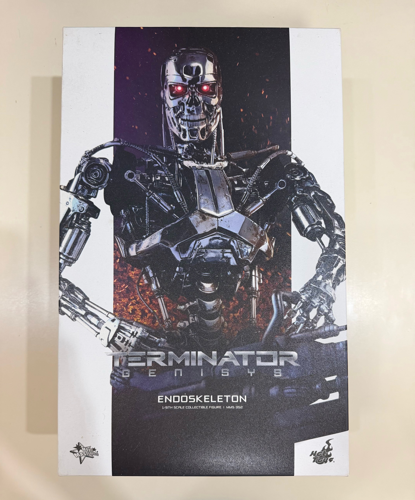

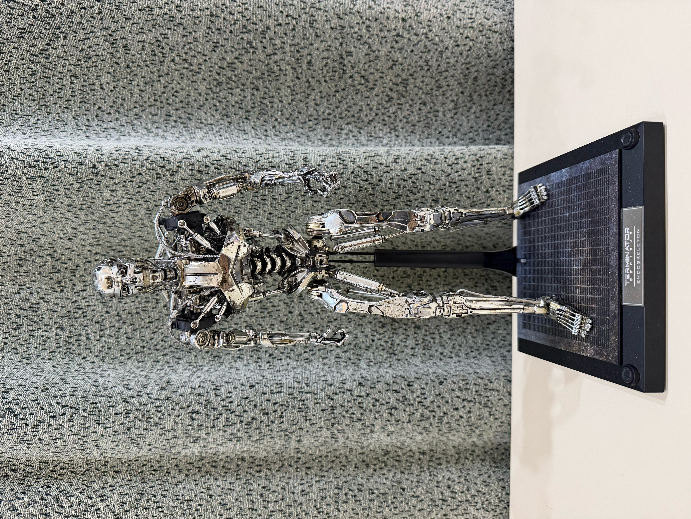

---

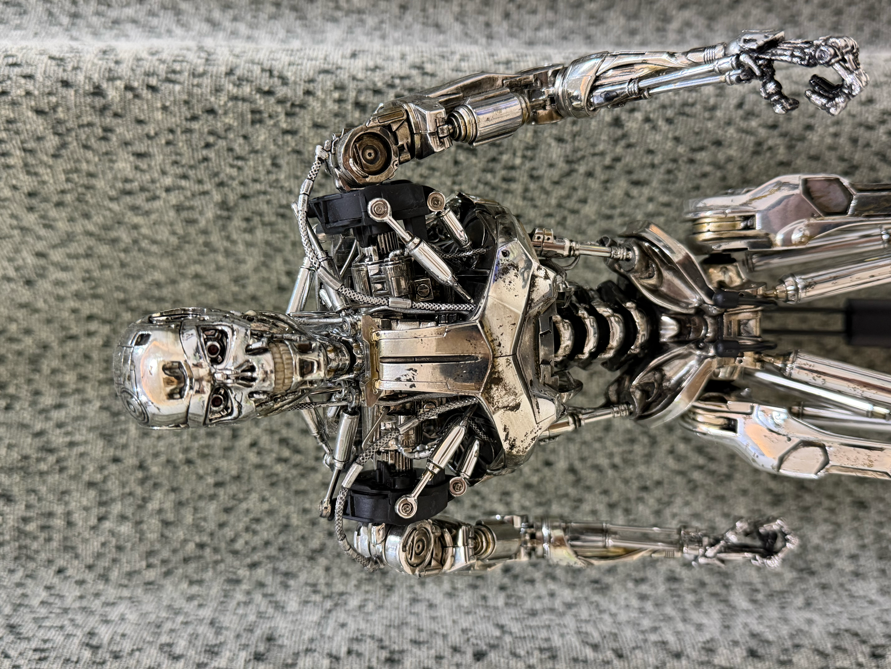

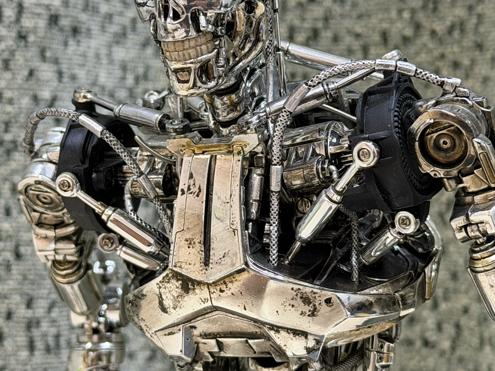

上半身和终结者 1 和 2 的设计略有不同。主要体现在大臂连接处黑色轴体、三角形胸甲，和脊柱。看起来不是战损的，但也不是那种完全全新出场的质感。

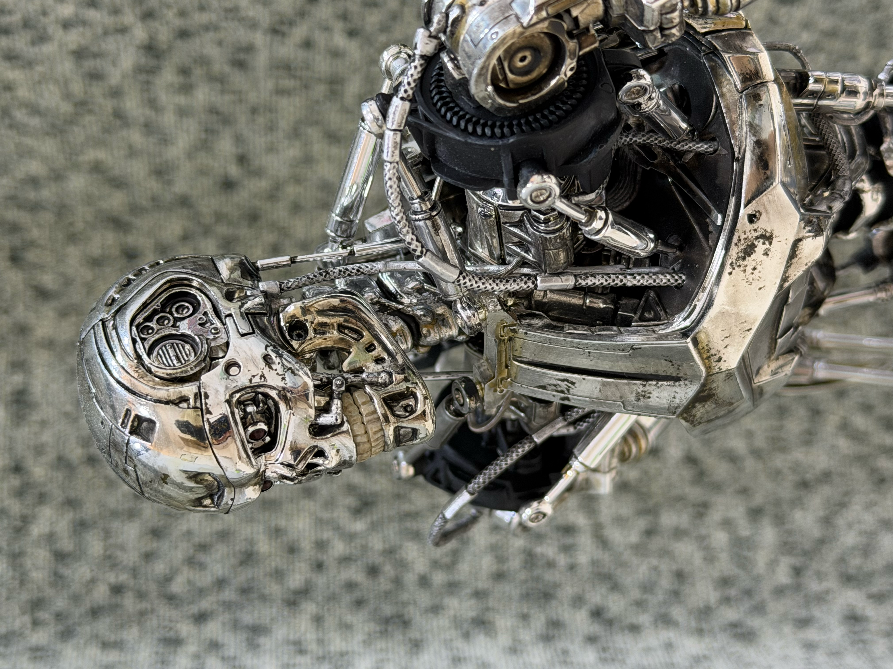

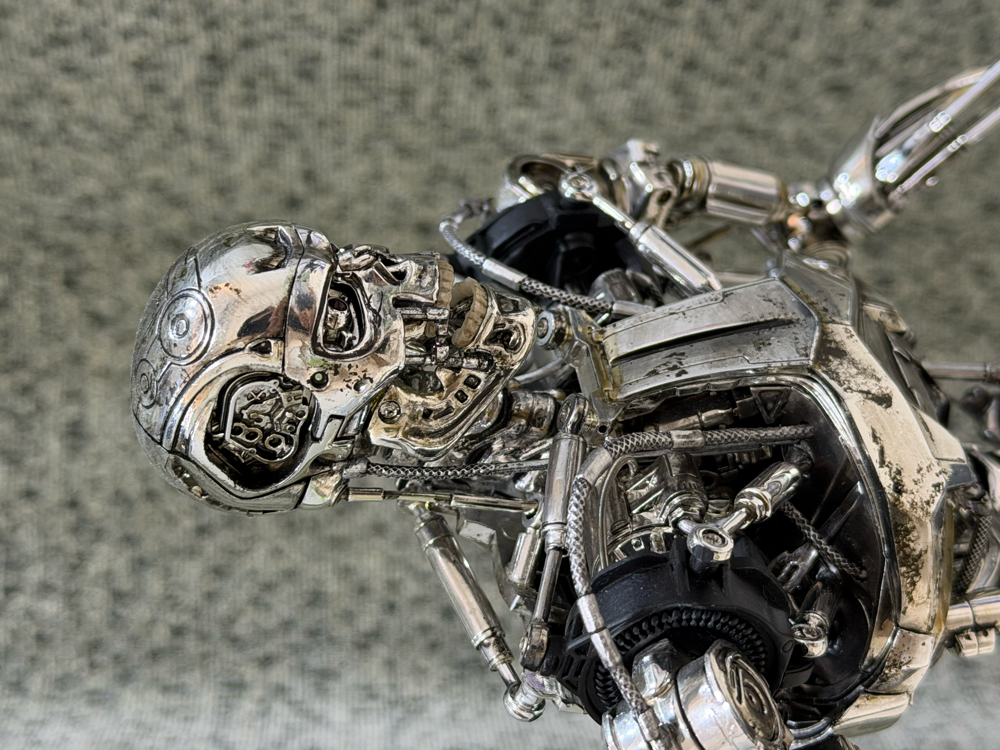

但是头部不能像新出的终结者那样把芯片槽打开。

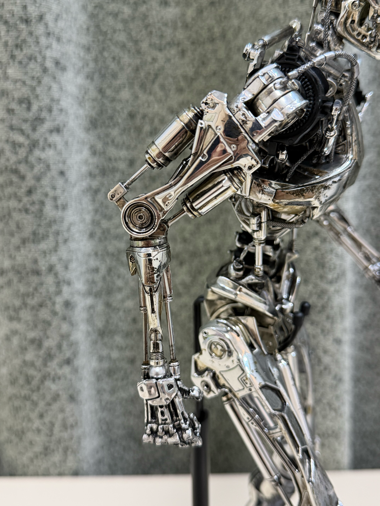

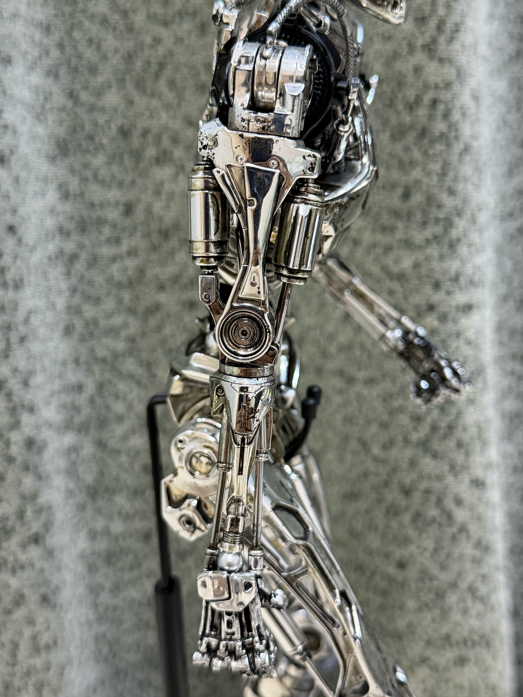

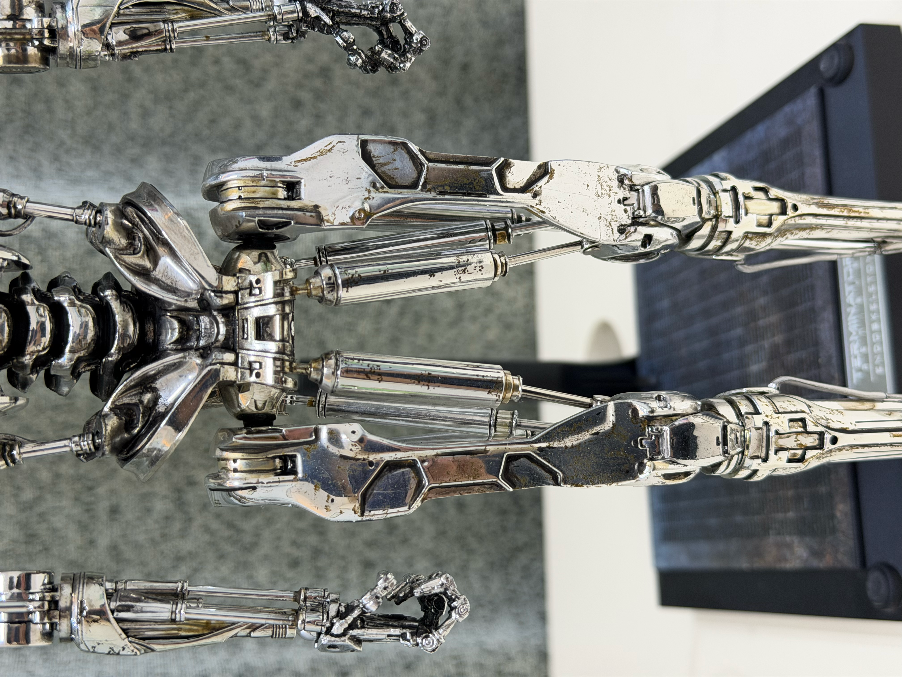

大臂和大腿的液压杆做出了传动机构，手均为软替换手。

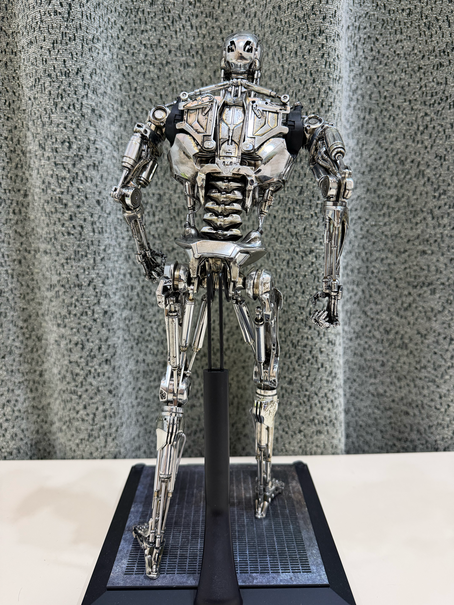

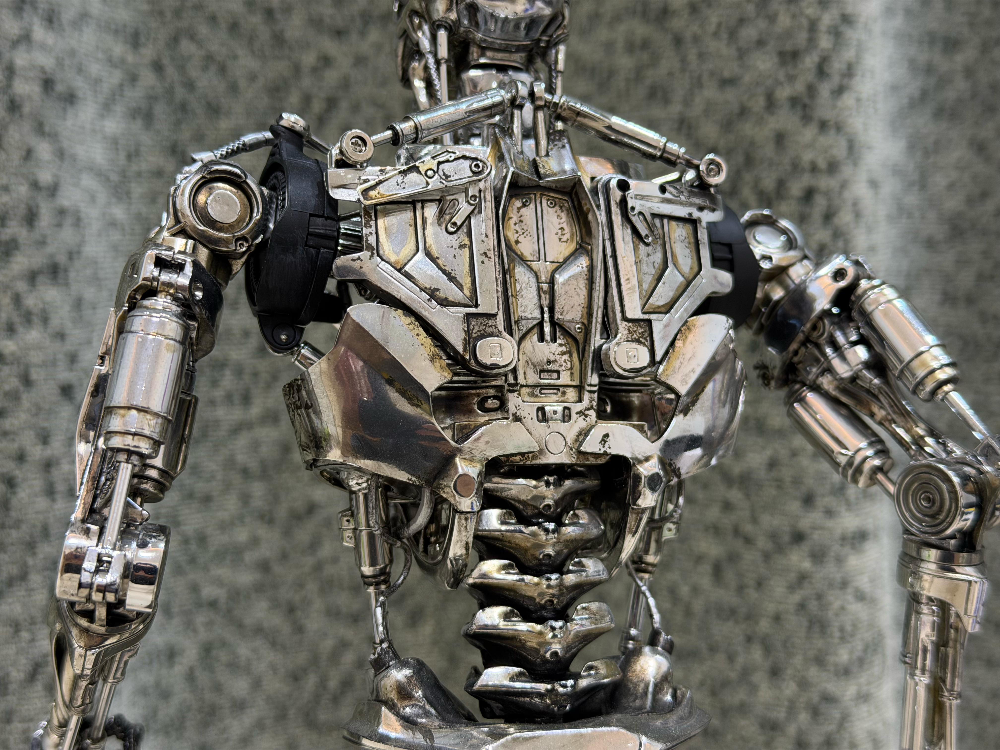

---

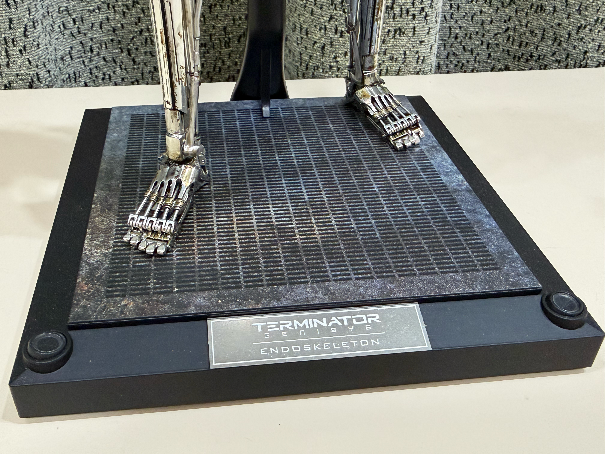

地台是打印的。

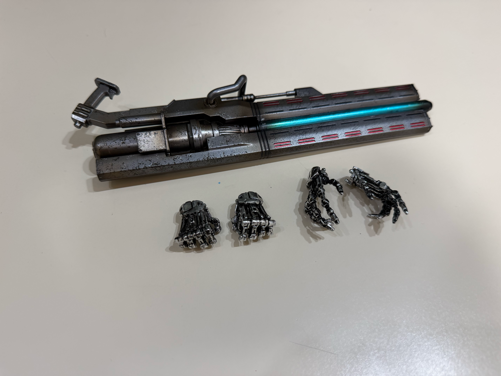

配件：手掌和握拳替换手，和一把枪，手时间太长氧化了。模型主体中间脊柱部分也有氧化掉漆。
