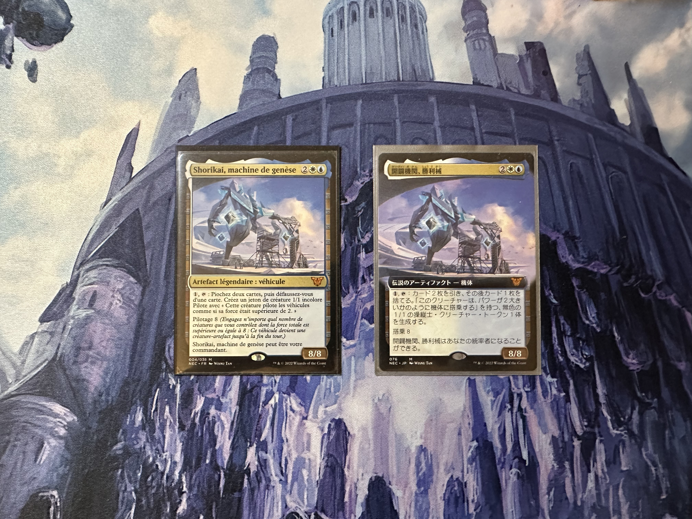
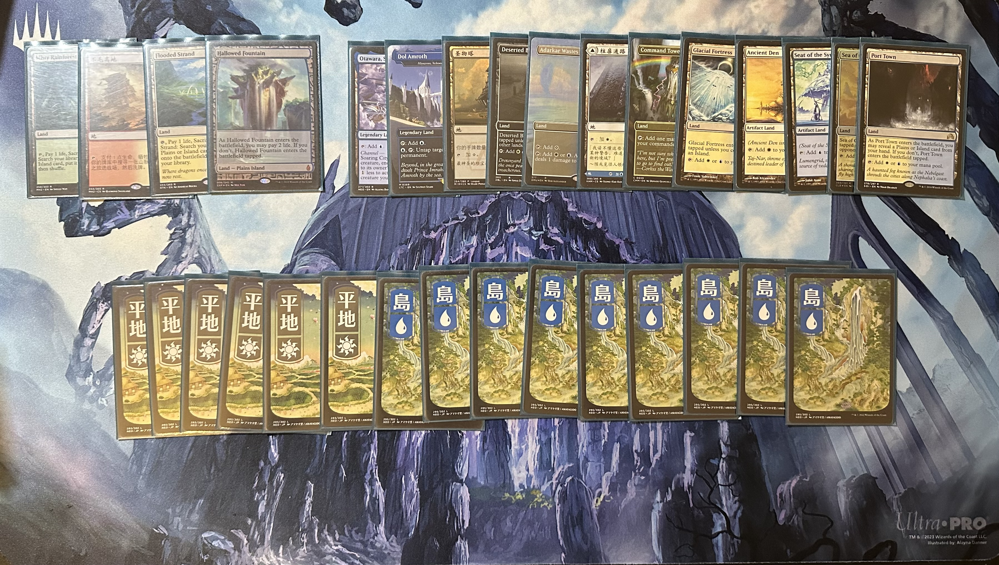
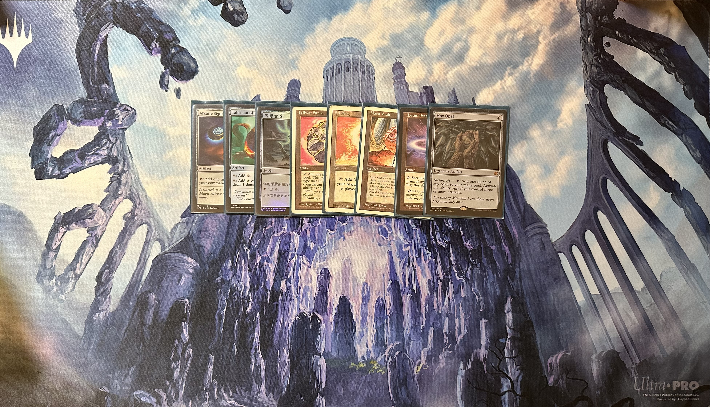
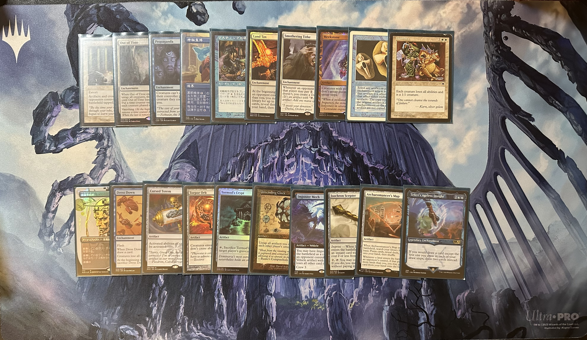
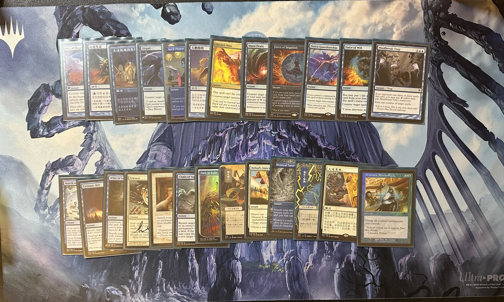
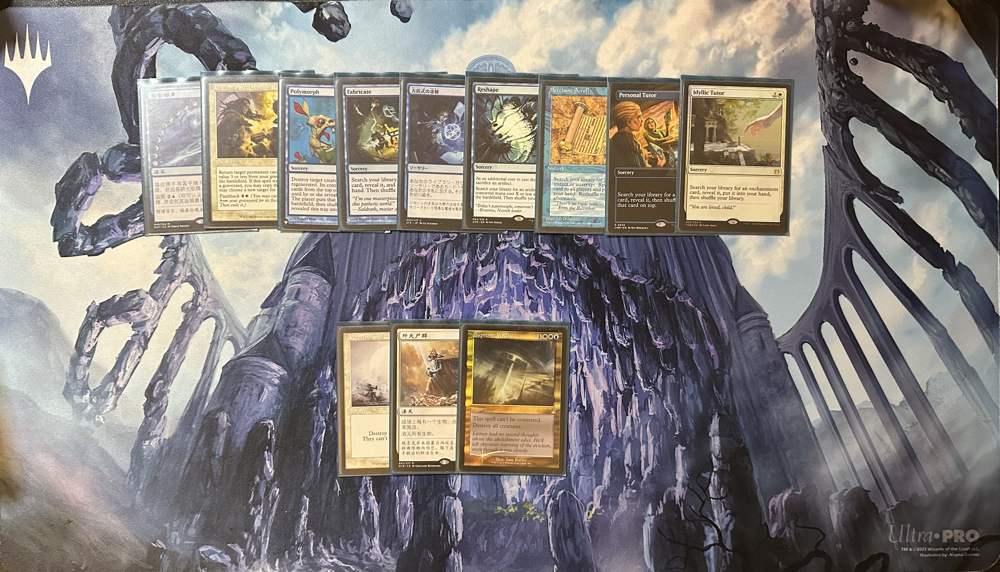
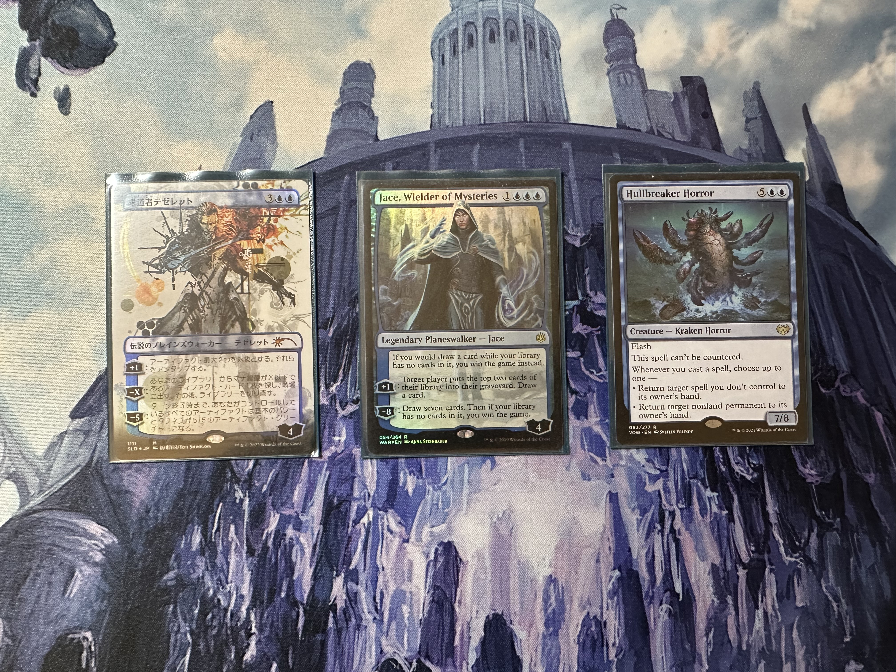
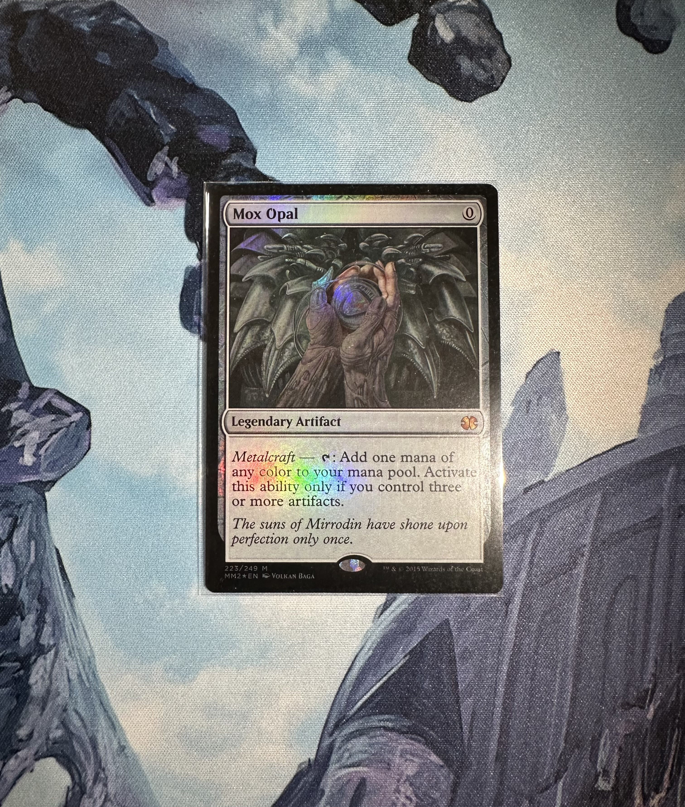
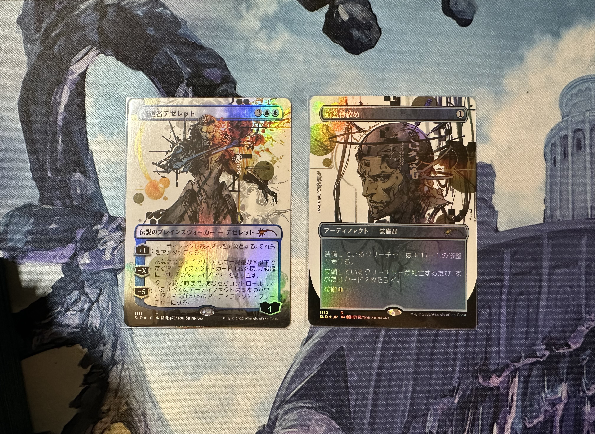

全套一张生物（碎船惊惧兽）的高达控锁组合技套牌，在国内外牌店折磨了不少路人。  
牌表链接：<https://moxfield.com/decks/C8zsmmszGUCdzB9UMDSKuQ>  
primer有空补上  
好像是当时在学校社团抄的邮差的牌表  
剩下的就是展示/纪念一下玩了三年多的版本

## 指挥官

法语版还是zqy从法国带回来的

## 法术力基础

## 神器&结界锁&赚牌引擎

## 控制咒语

## 实用法术&导师

## 生物&鹏洛客

## 值得纪念的版本

2023年在上海转机的时候买的，还是面交。当时这张闪的好像才400，前几天看平的都要560多

新川洋司画的 合金装备既视感
