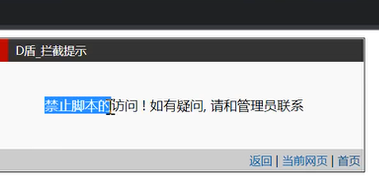
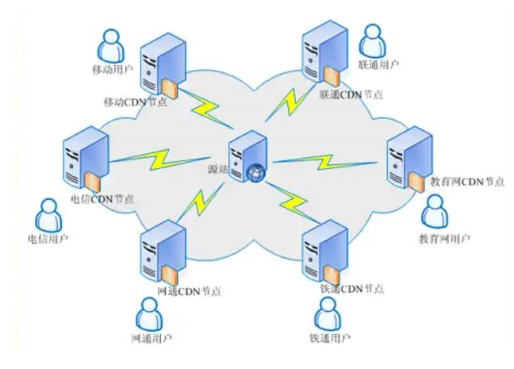
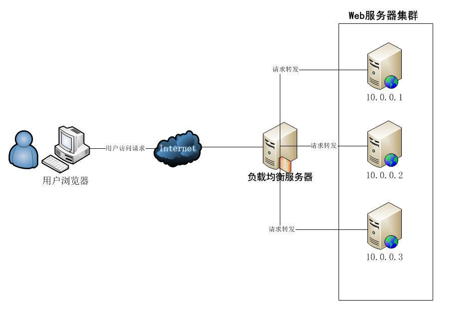

## I WAF - Web Application Firewall
**原理：Web应用防火墙，旨在提供保护  
影响：常规Web安全测试手段会受到拦截**  
演示：免费D盾防护软件  
Windows 2012 + IIS +D盾

未开启D盾：asp webshell（一句话木马）后门可以正常解析
开启后：


## II CDN - Content Delivery Network 内容分发网络
**原理：内容分发服务，它会把网站的图片、视频、CSS、JavaScript 等内容缓存到离用户更近的节点上，让访问更快，也能减轻源服务器压力。旨在提高访问速度  
影响：隐藏真实源IP，导致对目标测试错误**  
演示：阿里云备案域名全局CDN加速服务  
Windows 2012 + BT宝塔面板 + CDN服务

所以我想打一个网站的话 打的可能不是目标而是距离我近的一个网站
## III OSS - Object Storage Service 对象存储服务
专门储存文件的云服务：图片，视频，css，js,用户上传的附件，备份，日志 etc
在 AWS 中类似的服务叫 **Amazon S3**；阿里云的产品名就叫 **OSS**。

怎么存文件：
传统服务器的文件可能放在：
```
/var/www/html/images/logo.png
```
OSS 不强调传统文件夹，而是把每个文件当成一个“对象”：
```
Bucket：my-web-files
Object：images/logo.png
```
访问地址可能类似：
```
https://my-web-files.oss-example.com/images/logo.png
```

其中：

- ==**Bucket**：存储桶，相当于一个大的文件容器==
- ==**Object**：对象，也就是具体文件==
- ==**Object Key**：对象名称，例如 `images/logo.png`==

#### OSS 对 Web安全的好处
1. 将文件与Web程序分离
	传统网站可能把程序和上传文件放在同一个服务器里，如果上传功能有漏洞 攻击者可能上传后门病毒 shell.php, 如果执行了就形成了Web Shell。==OSS存储只是单纯的储存数据资源，没有代码执行环境，即使上传了后门脚本，也无法解析，相对于直接上传到网站服务器上，更加安全。==

2. 减少源服务器暴露面 下载文件 图片 视频 不必全部用Web服务器提供 减少攻击者接触它的次数

3. 可以使用更细的访问权限
   
4. OSS 通常支持针对 Bucket 和对象设置权限，例如：

```
公开读取
私有读取
禁止公开访问
只允许特定账号访问
只允许特定应用程序上传
```

```
网站公开图片：任何人可读取，但不能修改
用户私人文件：只有登录用户能读取
后台备份：只有服务器账号能访问
```

比起简单地给整个服务器目录开放权限，OSS 通常可以设置更精细的访问策略。
例如理想权限可能是：
```
普通用户：
只能上传到自己的目录
不能读取其他用户的文件
不能删除系统文件

Web服务器：
可以上传和读取指定Bucket
不能修改账号权限

管理员：
可以管理Bucket策略
```
这体现了**最小权限原则**： 每个身份只拥有完成工作所需的最低权限。

## IV 正向&反向代理
正向代理为客户端服务，客户端主动建立代理访问目标（不代理的话不可到达）翻墙原理
反向代理为服务端服务，服务端主动转发数据给可访问地址（不主动不可达）
原理：通过网络反向代理转发真实服务达到访问目的  
**影响：访问目标只是一个代理，非真实应用服务器**  
注意：正向代理和反向代理都是解决访问不可达的问题，但由于反向代理中多出一个可以重定向解析的功能操作，导致反代理出的站点指向和真实应用毫无关系！

宝塔创建反向代理：创建反向代理 - 代理名称 - 代理路径 - ==目标URL== 会直接把客户端转发过去

## V 负载均衡
原理：**分摊到多个操作单元上进行执行，共同完成工作任务**  
影响：**有多个服务器加载服务，测试过程中存在多个目标情况**  
演示：Nginx负载均衡配置  
Windows2012 + BT宝塔面板 + Nginx

宝塔面板修改负载均衡配置，*==*weight数值对应访问优先级。**==

==配置好负载均衡后，对baidu.whgojp.top**域名解析就会以1/2的概率分别访问这两个服务器**==
==正常生产环境是搭建两个相同的服务，以防止一个服务器宕机后网站不能使用服务==


```
upstream fzjh {  
server 203.0.113.21:80 weight=2;  
server 203.0.113.22:80 weight=1;  
}
```

定义访问路径 访问策略

```
location / {  
proxy_pass [http://fzjh/](http://fzjh/);  
}
```
