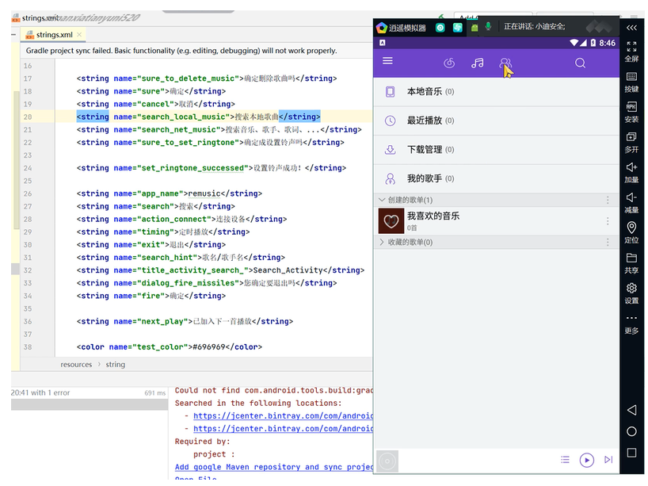

课程为小迪安全官方 2024 年上传，本文为个人学习笔记。

## APP 应用开发架构
##### 1、原生开发

**安卓一般使用java语言开发，当然现在也有Kotlin语言进行开发**。如何开发就涉及到具体编程了，这里就不详说了。简单描述就是使用安卓提供的一系列控件来实现页面，复杂点的页面可以通过自定义控件来实现。

##### 2、使用H5语言开发

**使用H5开发的好处有很多，可多端复用**，比如 浏览器 端，ios端，当然H5开发的体验是没有原生好的。结合我做过的项目来说，一般是这个页面需要分享出去的话，就用H5开发。

##### 3、使用flutter开发

flutter是近年来谷歌推出的一款UI框架，使用dart语言进行开发，支持跨平台，weight渲染直接操作硬件层，体验可媲美原生。**但是flutter技术比较新，生态还不完善，开发起来效率相对偏低。**

##### 4、常规Web开发

Web App软件开发简单地说，就是开发一个网站，然后加入app的壳。**Web App一般非常小，内容都是app内的网页展示，受制于网页技术本身，可实现功能少，而且每次打开，几乎所有的内容都需要重新加载，所以反应速度慢，内容加载过多就容易卡死，用户体验差，而且app内的交互设计等非常有效。但开发周期长端，需要的技术人员少，成本低。

## APP - 开发架构 - 原生态

演示：remusic项目源码  
安全影响：反编译&抓包&常规测试  
**安全影响：逆向的角度去分析逻辑设计安全**

## APP-开发架构–Web封装-封装平台

> 演示：ShopXO源码程序+一门APP打包(输入手机站网址或上传Html文件，三分钟在线生成APP)  
> 就是网站直接做成app
> 安全影响：常Web安全测试
 **使用平台将web网站封装成手机端APP，与单纯的web没有任何差异。**

## APP-开发架构-H5& Vue -HBuilderX
演示：HBuilderX案例  
**安全影响：API&JS框架安全问题&JS前端测试**

## WX小程序-开发架构-Web封装-平台

> 演示：ShopXO源码程序+一门APP打包  
> 安全影响：常规Web安全测试
> 
    演示：HBuilderX案例  
    安全影响：API&JS框架安全问题&JS前端测试
