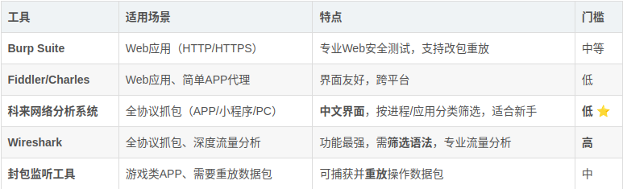
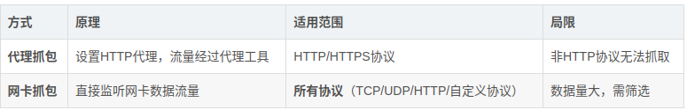
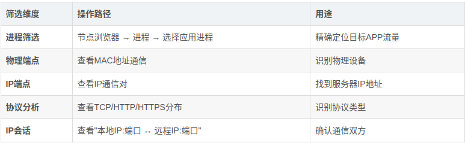
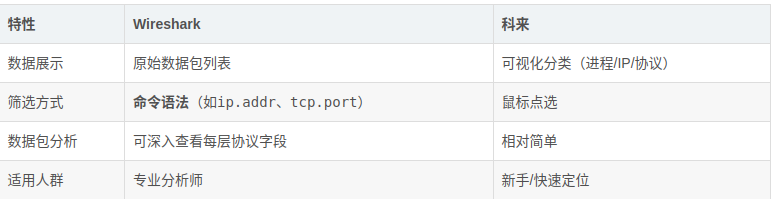
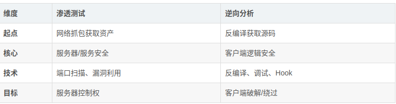
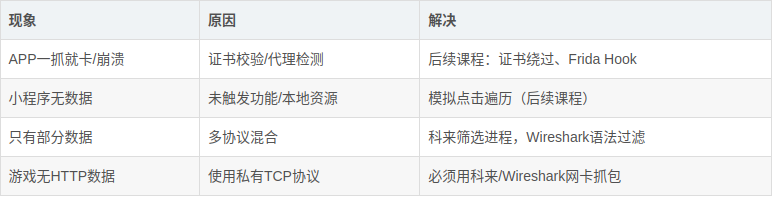

课程为小迪安全官方 2024 年上传，本文为个人学习笔记。

## 一、课程定位与知识体系
### 1.1 课程关系

    上节课：HTTP/HTTPS抓包（Burp Suite、Fiddler、Charles）
    本节课：非HTTP协议抓包（Wireshark、科来）+ APP/小程序/PC应用抓包

    后续课程：证书绕过、模拟点击遍历、逆向分析、流量分析（蓝队方向）

### 1.2 核心问题 <mark>为什么Burp Suite抓不到某些APP数据包？</mark>
这些APP使用非HTTP协议（自定义TCP协议、私有协议等），*Burp Suite仅支持HTTP/HTTPS代理抓包*

## 二、工具对比与选择

新手先用科来，专业人士后期用Wireshark做深度分析

## 三、核心原理：网卡模式抓包
### 3.1 代理抓包 vs 网卡抓包

### 3.2 网卡选择
    选择当前上网的网卡（如"以太网"）
    查看IP地址确认（如192.168.1.6）

## 四、科来网络 分析系统 实战
### 4.1 基础抓包流程

    Step 1: 打开科来 → 选择网卡（以太网）→ 点击"开始"
    Step 2: 打开目标APP/小程序进行操作
    Step 3: 科来中"暂停"抓包
    Step 4: 筛选分析（按进程/IP/协议）

### 4.2 核心筛选功能

观察指标：

<mark>数据包大小持续变动</mark> → 说明是实时通信服务器
<mark>固定IP:端口</mark> → 游戏服务器地址（如203.0.113.45:8005）
<mark>大量数据传输</mark>→ 游戏动态数据（人物移动、战斗数据）

#### 实战示例：

    发现：本地10301端口 ↔ 远程203.0.113.45:8005（TCP协议）
    结论：203.0.113.45 为游戏服务器IP，8005为通信端口
    应用：后续可对203.0.113.45进行端口扫描、服务识别

## 五、Wireshark实战
### 5.1 操作流程

    Step 1: 选择网卡（与科来相同）
    Step 2: 开始抓包 → 操作APP → 停止抓包
    Step 3: 使用筛选语法过滤（如ip.addr==203.0.113.45）

### 5.2 与科来的对比

    # 按IP筛选
    ip.addr == 203.0.113.45
     
    # 按端口筛选
    tcp.port == 8005
     
    # 按协议筛选
    http / https / tcp / udp
     
    # 组合条件
    ip.addr == 203.0.113.45 && tcp.port == 8005

## 六、封包监听技术（游戏类APP专用）
### 6.1 核心功能

<mark>捕获</mark>：记录所有发送/接收的数据包

<mark>重放</mark>：重复发送特定数据包（类似Burp Repeater）

<mark>修改</mark>：篡改数据包内容（外挂原理）

### 6.2 操作配置

    配置项：
    ├─ 只显示模拟信息层（过滤无关数据）
    ├─ 发送方（只看客户端→服务器的包）
    ├─ 封包大小（不过滤）
    └─ 进程选择（指定模拟器进程）

### 6.3 实战：数据包重放

场景：游戏"瞬移"功能测试

    Step 1: 开始抓包 → 在手机上执行"瞬移"操作 → 停止抓包
    Step 2: 找到瞬触发的数据包（标记为R45）
    Step 3: 选中该数据包 → 点击"发送"
    Step 4: 游戏角色再次瞬移（无需点击游戏按钮）

安全测试价值：

    渗透测试角度：获取服务器IP、端口、通信协议

    逆向角度：分析业务逻辑、寻找越权/重放漏洞

## 七、应用场景实战
### 7.1 APP抓包（以游戏为例）

工具组合：

    科来/Wireshark：抓网卡流量，找服务器IP
    封包工具：捕获并重放游戏操作包

关键发现：

    资产信息：
    - 服务器IP：203.0.113.45（广州，京东云）
    - 通信端口：8005（TCP）
    - 关联域名：vangus.com（北京玩睿旅科技有限公司）
    - 其他端口：4389（可能为管理接口）
     
    后续测试方向：
    - 对203.0.113.45进行全端口扫描
    - 测试8005端口服务漏洞
    - 分析4389端口服务
    - 查询vangus.com其他子域名/IP

### 7.2 小程序抓包

特点：
<mark>大部分小程序走HTTPS</mark>（可被Burp/科来抓取）
部分游戏类小程序走私有TCP协议（需科来/Wireshark）

操作：

1. 打开科来 → <mark>选择微信进程</mark>（WeChatAppEx.exe）
2. 打开小程序（如汽车之家、欢乐斗地主）
3. 查看「<mark>IP 站点</mark>」和「<mark>域名</mark>」标签
4. 筛选 HTTP 协议查看 Web 请求

### 注意事项：

部分数据为本地资源（已打包在小程序内），不产生网络流量
<mark>需触发特定功能（如点击、登录）才能抓到对应数据包</mark>

### 7.3 PC应用抓包

更简单：直接选择进程即可

示例：斗鱼直播伴侣、腾讯会议、腾讯文档
方法：<mark>科来 → 进程筛选 → 选择应用进程 → 查看通信IP/域名</mark>

## 八、安全测试方法论
### 8.1 渗透测试角度

    抓包目的：获取资产信息（IP/域名/端口/服务）
             ↓
    信息收集：服务器地址、开放端口、Web服务、API接口
             ↓
    安全测试：
      ├─ Web安全：网站漏洞扫描、渗透测试
      ├─ 服务安全：数据库、第三方组件、其他端口服务
      └─ 接口安全：API测试、OSS资源、云存储配置

### 8.2 逆向分析角度（后续课程）

    反编译源码 → 找资产信息 → 渗透测试
             ↜ 找泄露配置（密钥、API Key、数据库连接）
             ↜ 分析逻辑漏洞（加密绕过、验证缺陷、重打包）

### 8.3 两种角度对比

---

## 十、核心考点总结（ SRC /CTF/面试）
10.1 必考知识点

表格
考点	答案要点
为什么Burp抓不到APP包？	APP可能使用非HTTP协议（自定义TCP），Burp只支持HTTP代理
网卡抓包与代理抓包区别？	网卡抓包监听所有协议流量；代理抓包仅HTTP/HTTPS经过代理
科来 vs Wireshark？	科来中文可视化，适合新手快速定位；Wireshark功能强，需筛选语法，适合深度分析
如何找游戏服务器IP？	科来筛选进程 → 观察持续通信的IP:端口 → 数据包大小变动的是游戏服务器
封包监听核心价值？	捕获并重放数据包，测试业务逻辑漏洞（如重复领取奖励）
小程序抓包注意事项？	部分资源本地打包不产生流量；需触发功能才能抓到对应请求
10.2 面试高频题

Q1：APP抓不到包，如何排查？

        确认是HTTP还是私有协议（Burp开代理看能否抓到其他HTTP）

        尝试网卡抓包（科来/Wireshark）

        检查APP是否检测代理（挂代理即崩溃）

        考虑证书校验（SSL Pinning）或反代理技术

Q2：抓到IP后如何进一步测试？

        端口扫描（nmap -p-）

        服务识别（-sV）

        Web目录扫描（如有Web服务）

        查询IP关联域名（威胁情报平台）

        测试特定端口服务漏洞

Q3：封包重放的漏洞风险？

        业务逻辑漏洞：重复操作（多次瞬移、重复领取）

        越权漏洞：修改用户ID参数

        数据篡改：修改金币/积分数值（客户端校验不严时）

10.3 实战Checklist

plain

复制

    □ 确定目标应用类型（APP/小程序/PC）
    □ 尝试Burp代理抓包（确认是否HTTP协议）
    □ 打开科来 → 选择网卡 → 筛选目标进程
    □ 操作应用功能，观察数据包变动
    □ 识别服务器IP（持续通信、数据量大）
    □ 记录IP:端口、协议类型、关联域名
    □ （游戏类）使用封包工具捕获关键操作包
    □ （需要时）尝试重放数据包测试逻辑漏洞
    □ 信息收集：对发现IP进行端口/服务扫描
