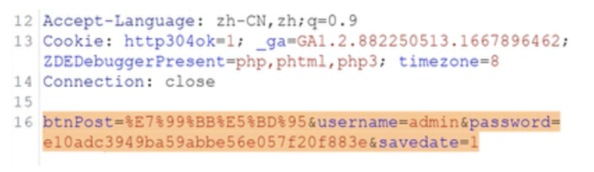
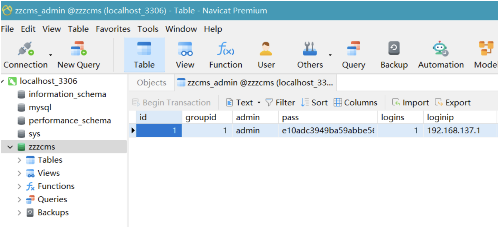
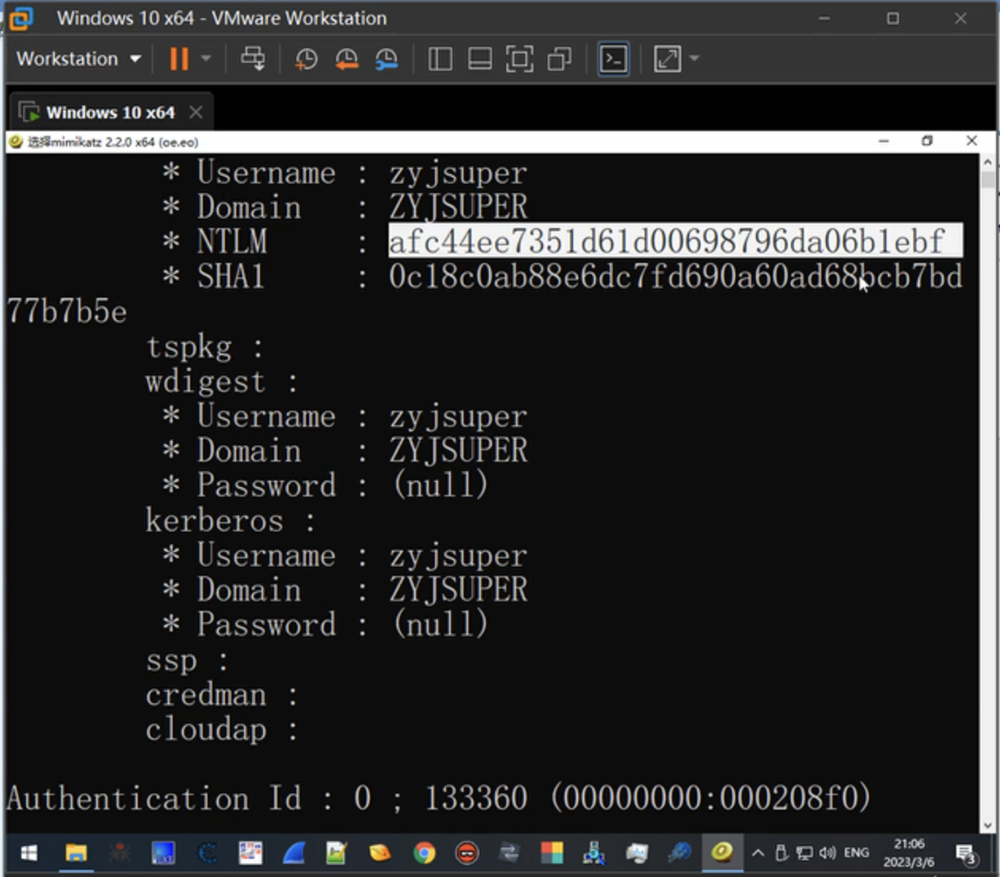
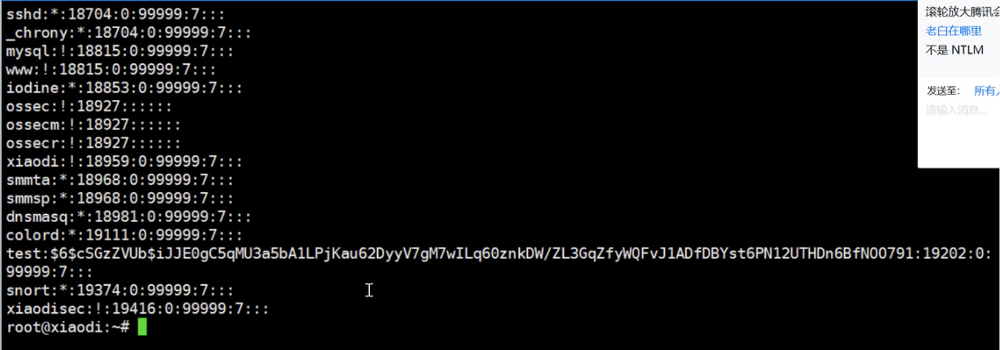
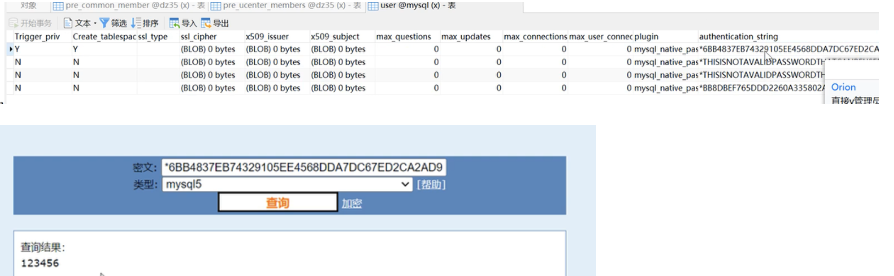
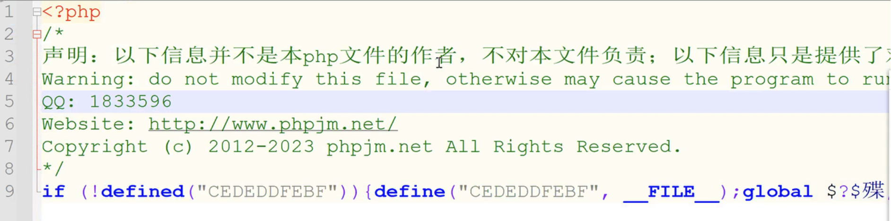

<span class="post-note"><span class="i18n" data-lang="zh">课程为小迪安全官方 2024 年上传，本文为个人学习笔记。</span><span class="i18n" data-lang="en">Course published by XiaoDi Security in 2024. These are my personal study notes.</span></span>

**演示案例：  
传输数据：编码型&加密型等  
传输格式：常规&JSON&XML等  
密码存储：Web&系统&三方应用  
代码混淆：源代码加密&逆向保护

# 1. 传输数据-编码型&加密型等

例：
- 某视频
- 某Web站
- 博客登录
- APP-斗地主
影响：漏洞探针

https://indialms.in/wfp_login.php?r_id=1
base64编码
username=YWRtaW4=
https://indialms.in/wfp_login.php?r_id=MQ== 112123
⬆️ 把id=1编码成了id=MQ==

图片中高亮的这一行是 **HTTP POST 请求的请求体，更具体说，是以 `application/x-www-form-urlencoded` 格式提交的表单数据。

btnPost=%E7%99%BB%E5%BD%95
&username=admin
&password=e10adc3949ba59abbe56e057f20f883e
&savedate=1

- `btnPost=%E7%99%BB%E5%BD%95`
    - `%E7%99%BB%E5%BD%95` 是 URL 编码
    - 解码后是 ==**登录==**
    - 相当于 `btnPost=登录`
- `username=admin`
    - ==用户名==是 `admin`
- `password=e10adc3949ba59abbe56e057f20f883e`
    - 这是一个 **32 位十六进制字符串**，外观上很像 ==MD5== 哈希。是123456
    - 也就是说这里客户端很可能把密码先做了 MD5，再提交给服务器。
- `savedate=1`
    - 一个表单参数，具体含义取决于网站代码。
    - 从名字看可能和“记住登录/保存登录状态时间”有关，但不能只凭截图确定。

### 数据在传输的时候进行编码 为什么要了解？

对方服务器可能会在接受的时候进行解码再带入，如果我们还是按照原有思路不对自己的Payload进行同样编码的话 传入过去的东西就是不认识的东西 测试无效

正确：测试的话也要进行payload同样的加密或编码进行提交安全测试漏洞时候 通常都会进行数据的修改增加提交测试以数据的正确格式发送 接受才行

登录的 数据包：admin 123456

MD5加密
username=admin&password=**123456**
username=admin&password=**e10adc3949ba59abbe56e057f20f883e**

# 2. 传输格式：常规 & JSON & XML等
影响：发送漏洞探针，回显数据分析
漏洞探针：发送一些特定的测试请求，看看目标有没有某种漏洞。比如怀疑一个参数存在 SQL 注入，就构造一个测试输入，然后观察服务器的响应内容、状态码、报错、响应时间等是否异常。

```
btnPost=xxx&username=admin&password=xxx&savedate=1
    → 表单格式（URL-encoded），典型 application/x-www-form-urlencoded

{ "username": "admin", "password": "xxx" }
   → JSON 格式，典型 application/json

XML
    → XML 格式，例如 <x>123</x>

x=123
    → 普通的 键值对/表单参数形式
```

如果现在我要进行密码的破解爆破

字典文件：  
**帐号什么都不用更改 去替换username=值即可  
密码需要进行密码算法 保证和password=值==同等加密==才行**

# 3. 密码存储-Web & 系统 & 三方应用
1. zzcms2023：本质上就是一个 CMS（内容管理/建站系统）**，可以理解成“别人已经写好的一套网站程序”。
数据库里的内容：username: admin, password: e10adc...

使用CMD5查询密码e10adc... 为123456

2. Discuzx32同上
3. 忽略 同上
4. Windows 10 & Linux
Windows 10 x64:

这里使用了mimikatz，它主要用来研究/提取 Windows 中的身份认证信息，例如：NTLM 哈希，Kerberos 票据，某些情况下内存中的登录凭证，Windows LSA/LSASS 相关认证数据。（hashdump）

NTLM（NT LAN Manager） 是 Windows 里的一套身份认证机制。Windows 不需要直接拿你的明文密码去验证，而是可以基于密码生成的 NTLM Hash（哈希值）来完成认证。通过 ==Pass-the-Hash==进行身份认证

Linux里面的shadow：
5. MSSQL & MySQL

**安全后渗透测试，不同的web网站对于管理员密码的加密算法不同**

zzzcms - admin:123456 密文利用md5加密
md5(123456)=密文

dz3.2 - admin:123456
md5(md5(123456).salt)=密文

dz3.5 - admin:123456
AES DES（密匙 偏移量 填充 模式等）
$2y 10 10 10OtsSmawENczg1BLcQCEn5OdLqJC9GLiDrClwEUooNnn8b609DfJc.

大部分的解密都是碰撞式解密
不是算法的逆向的还原解密
123456 e10adc3949ba59abbe56e057f20f883e

Xiaodi!@#123...da

解密：
对应上还原就是123456
1密文是多少
1
2
3
4
5
123
1234
12345
123456 密文是多少

# 代码混淆- 源代码 加密 & 逆向保护
PHP & JS混淆加密  
EXE & JAR代码保护  

影响：代码审计，逆向破解

`<?php phpoinfo()?>` 使用php加密工具之后：

JS也同样有此类工具（JSFUCK）

**==大部分的解密都是碰撞式解密，不是算法的逆向的还原解密==**

1.常见加密编码进制等算法解析
MD5，SHA，ASC，进制，时间戳，URL，BASE64，Unescape，AES，DES等

2.常见加密编码形式算法解析
直接加密，带salt，带密码，带偏移，带位数，带模式，带干扰，自定义组合等

3.常见解密解码方式（针对）
枚举，自定义逆向算法，可逆向

4.常见加密解码算法的特性
长度位数，字符规律，代码分析，搜索获取等


# 本课意义：
**1.了解加密编码进制在安全测试中的存在**  
**2.掌握常见的加密解密编码解码进制互转的操作**  
**3.了解常见的加密解密编码解密进制互转的影响**

#### 识别算法编码方法：
> **1、看密文位数  
> 2、看密文的特征（数字，字母，大小写，符号等）  
> 3、看当前密文存在的地方（Web，数据库，操作系统等应用）


传输数据编码：
    BASE64 URL HEX ASCII
    BASE64值是由数字"0-9"和字母"a-f"所组成的字符串,大小写敏感,结尾通常有符号=
    URL编码是由数字"0-9"和字母"a-f"所组成的字符串,大小写敏感,通常以%数字字母间隔
    HEX编码是计算机中数据的一种表示方法,将数据进行十六进制转换,它由0-9,A-F,组成
    ASCII编码是将128个字符进行进制数来表示,常见ASCII码表大小规则：09<AZ<a~z
    -传输数据加密：同密码存储加密
    -传输数据格式：常规字符串 JSON XML等


密码存储加密：
    MD5 SHA1 NTLM AES DES RC4
    MD5值是***32或16***位位由数字"0-9"和字母"a-f"所组成的字符串
    SHA1这种加密的密文特征跟MD5差不多，只不过***位数是40***
    NTLM这种加密是Windows的哈希密码，标准通讯安全协议
    AES,DES,RC4这些都是非对称性加密算法，引入密钥，密文特征与Base64类似

代码混淆：
    JS前端代码加密：
    JS颜文字 jother JSFUCK
    颜文字特征：一堆颜文字构成的js代码，在F12中可直接解密执行
    jother特征：只用! + ( ) [ ] { }这八个字符就能完成对任意字符串的编码。也可在F12中解密执行
    JSFUCK特征：与jother很像，只是少了{ }

后端代码混淆：
    PHP .NET JAVA
    PHP：乱码，头部有信息
    .NET：DLL封装代码文件，加保护
    JAVA：JAR&CLASS文件，，加保护
    举例：加密平台 Zend ILSpy IDEA
    应用场景：版权代码加密，开发特性，CTF比赛等


    在线加解密网站汇总：
    https://www.cmd5.com
    http://tmxk.org/jother
    http://www.jsfuck.com
    http://www.hiencode.com
    http://tool.chacuo.net/cryptaes
    https://utf-8.jp/public/aaencode.html
    https://github.com/guyoung/CaptfEncoder

    1.30余种加密编码类型的密文特征分析：https://mp.weixin.qq.com/s?__biz=MzAwNDcxMjI2MA==&mid=2247484455&idx=1&sn=e1b4324ddcf7d6123be30d9a5613e17b&chksm=9b26f60cac517f1a920cf3b73b3212a645aeef78882c47957b9f3c2135cb7ce051c73fe77bb2&mpshare=1&scene=23&srcid=1111auAYWmr1N0NAs9Wp2hGz&sharer_sharetime=1605145141579&sharer_shareid=5051b3eddbbe2cb698aedf9452370026#rd
    2.CTF中常见密码题解密网站总结
    https://blog.csdn.net/qq_41638851/article/details/100526839
    3.CTF密码学常见加密解密总结
    https://blog.csdn.net/qq_40837276/article/details/83080460
