<span class="post-note"><span class="i18n" data-lang="zh">课程为小迪安全官方 2024 年上传，本文为个人学习笔记。</span><span class="i18n" data-lang="en">Course published by XiaoDi Security in 2024. These are my personal study notes.</span></span>

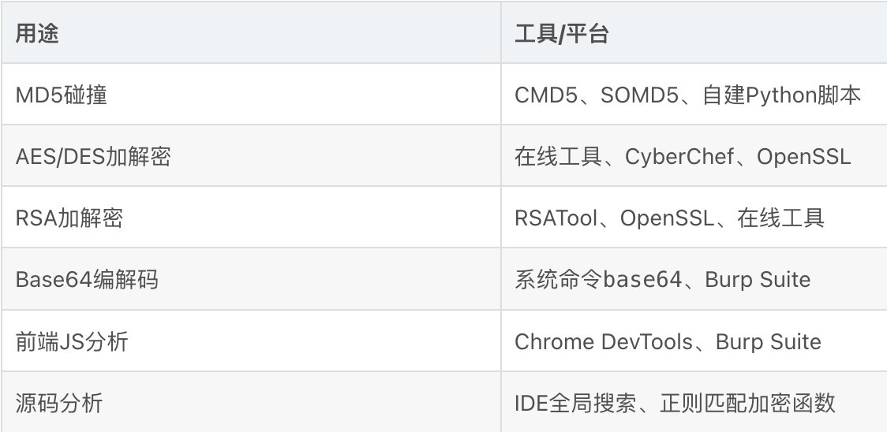### 1. 加密算法分类与核心特征

#### 1.0 三大 加密 类型对比
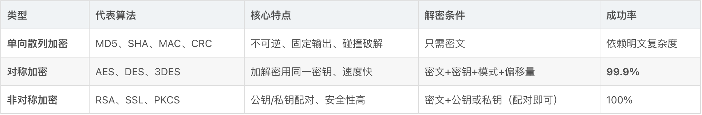

#### 1.1 单向散列加密详解（MD5/SHA）
加密之后无法算回去
核心原理：
1. 碰撞机制：固定明文 -> 固定密文，通过预计算字典反向查询
2. 无额外参数：仅需明文和密文，无需密钥/偏移量
3. 加盐防御：MD5(MD5(明文)+盐值) 增加破解难度。如果算一遍就是MD5(明文+盐)

MD5识别特征：
1. 固定长度：16位或32位
2. 字符范围：仅 0-9 和 a-f（十六进制）
3. 不可逆：无解密函数，只能碰撞

**实战案例：PHP MD5加盐加密**
```php
// 源码逻辑：两次MD5+盐值
$hash = MD5(MD5($password).$salt);
 
// 逆向脚本思路（碰撞法）
$password = "123456";  // 尝试值
$a = MD5($password);
$aa = $a.$salt;      // 连接盐值
$aaa = MD5($aa);       // 二次加密
if($aaa == $target_hash) { echo "OK"; }
```
#### 1.2 对称加密详解（AES/DES）
加密和解密用的是同一把 key
最常用的对称加密算法是 **AES**，比如 AES-256 就是用 256 位的 key。HTTPS 传输数据、硬盘加密、压缩包加密码，底层基本都是它

必备解密四要素：

1. 密文 (Base64或Hex格式)
2. 密钥 (Key)
3. 加密模式 (ECB/CBC/CFB/OFB/CTR)
4. 偏移量 (IV), CBC等模式必需

AES vs DES 特征识别：

    密文含 + 或 / 符号 → 大概率是AES/DES（Base64编码后）
    明文越长密文越长（与MD5固定长度区别）
    尾部常有 = 填充

AES加密示例流程：
明文"xiaodisec" 
→ 密钥"123456" 
→ 模式"AES-128-ECB" 
→ Base64编码 
→ 密文输出

**解密工具使用要点：**

- 模式错误 → 解密失败
- 密钥错误 → **绝对失败**
- 偏移量错误（CBC模式）→ 解密失败

#### 1.3 非对称加密详解（RSA）

核心机制：

1. 密钥对：公钥（Public Key）+ 私钥（Private Key）
2. 配对规则：公钥加密→私钥解密；私钥加密→公钥解密
3. 特征：密文长度固定、==每次加密结果不同==

解密条件（满足其一即可）：
    密文 + 公钥（对方用私钥加密时）
    密文 + 私钥（对方用公钥加密时）
    最佳实践：同时获取公钥和私钥，双向验证

额外：RSA可以**加密**和**签名**，是同一对密钥的两种用法
1. 加密：public key加密，private key解密
*密文 = 加密(明文, 对方的公钥)*
*明文 = 解密(密文, 对方的私钥)*
谁都可以用公钥给你加密，但只有持有私钥的你能解开。解决的是**保密**问题：别人看不到内容。
2. **签名：私钥签名，公钥验证**
签名 = 签名(消息的哈希, 自己的私钥)
验证(别人发的消息/文件, 签名, 自己的公钥) → 通过 / 不通过

只有你能用私钥生成签名，但所有人都能用公钥验证。解决的是**身份和完整性**问题：证明这条消息确实是你发的，而且中途没被改过。签名本身不保密，消息可以是明文公开的。
注意签名的对象通常是**消息的哈希**，而不是消息本身，这样不管消息多大，签名都很短，而且消息改了一个字，哈希就完全变了，验证就会失败。这里又用上了前面说的哈希。

### 2. 密文识别与 解密方法 论

#### 2.1 密文特征速查表
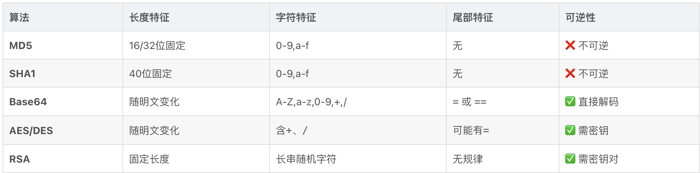
这种网站可以大概自动识别：https://www.dcode.fr/cipher-identifier

#### 2.2 标准解密流程（重点）
观察密文特征，初步判断算法类型
	如果能识别 -> 直接解密
	如果不能，获取源码。后端加密 找源码，前端加密 抓包找JS

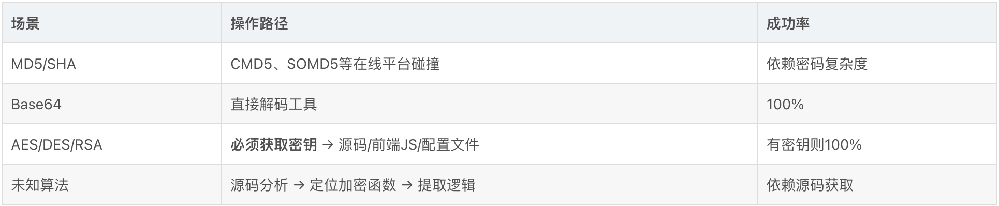

### 3. 实战：源码级加密分析
#### 3.1 后端加密（PHP示例）

分成了两类密码存储：1. **自定义 MD5 + salt** 和 2. **PHP** **`password_hash()`**

I. **场景**：已经获取数据库密码密文，需还原明文
**分析步骤：**
1. **定位加密文件**：`user.php` → `adduser` 函数
2. **提取加密逻辑**：`MD5(MD5($password).$salt)`
3. **构建碰撞脚本**：按相同逻辑遍历字典

 II. **PHP内置哈希识别：**
- `password_hash()` 函数 → 使用 `password_verify()` 验证
- 特征：以 `$2y$` 开头（bcrypt算法）
- **注意**：CMD5等平台无法破解，需自建脚本碰撞

*一长串就是 PHP 内置函数 `password_hash()` 生成的结果*
自己写的碰撞脚本：
```php
<?PHP
$hash = '$2y$10$KA.7VYVheqod8F3X65tWjO3ZXfozNA2fC4oIZoDSu/TbfgKmiw7xO';
if (password_verify('1234', $hash)) {
    echo 'ok';
} else {
    echo 'error';
}
?>
```

**验证**, `password_verify` 做的事情就是前面说的"取出盐，和输入的密码一起重新算一遍，看结果对不对得上"。秘密全在那串 `$hash` 里，拆开看是这样的：
```
$2y$ 10 $ KA.7VYVheqod8F3X65tWjO 3ZXfozNA2fC4oIZoDSu/TbfgKmiw7xO
 │    │    └──── 盐（22 位）────┘ └──────── 哈希值（31 位）───────┘
 │    └ 计算强度 cost = 10
 └ 算法标识：2y = bcrypt
```
`password_verify('1234', $hash)` 的执行过程是：

1. 从字符串里读出算法是 bcrypt、cost 是 10、盐是 `KA.7VYVheqod8F3X65tWjO`。
2. 用这三个参数，对 `'1234'` 重新做一次 bcrypt 计算。
3. 把算出来的结果和字符串后面那 31 位 `3ZXfoz...7xO` 比较，一样就返回 `true`，输出 `ok`；不一样就输出 `error`。

所以这个字符串是"自带说明书"的，验证需要的所有信息都在里面，不用单独存盐，也不用告诉函数用的是什么算法。这也是为什么上一轮说 `password_hash` 生成的结果直接存一个字段就够了。

cost = 10 的意思是内部循环 2¹⁰ = 1024 轮，这就是 bcrypt 故意"慢"的来源。以后硬件变快了，可以把 cost 调到 11、12，每加 1 计算时间翻倍，而旧密码因为字符串里记着自己的 cost，照样能正常验证。

#### 3.2 前端加密（JavaScript 逆向）
**核心优势**：==前端代码完全可见，无需服务器权限==

案例Z-Blog后台登陆页面：
在登陆键右键：
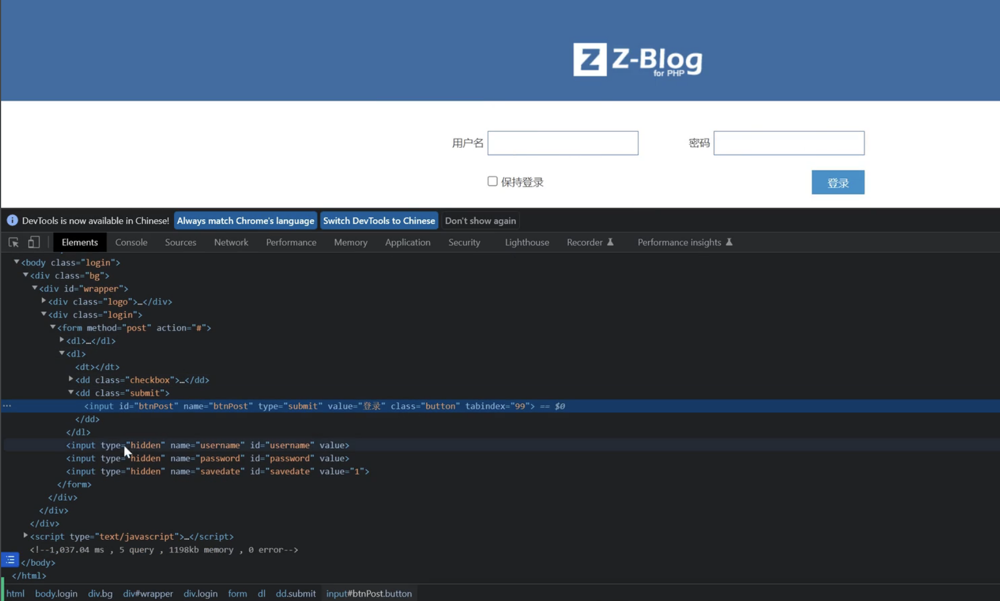

倒数第二行MD5(strPassWord)：
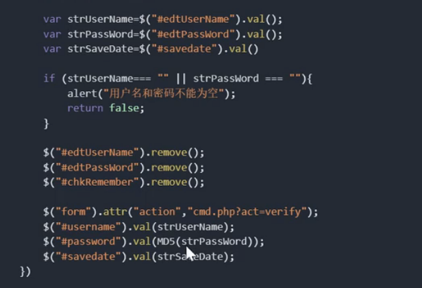
但是验证还是使用后端，拿着刚算的MD5和用户名

**分析流程：**

1. **抓包定位**：登录请求 → 观察密码字段变化
2. **查找JS引用**：搜索 `md5.js`、`aes.js` 等加密库
3. **跟踪加密逻辑**：
```javascript
// 典型前端加密
var pwd = document.getElementById('password').value;
var encrypted = MD5(pwd);  // 调用自定义MD5函数
```
4. **提取算法参数**：密钥、模式、偏移量通常硬编码在JS中

### 4. 靶场实战：加密 算法 与SQL注入

#### 4.1 场景描述
网址id=后面的值看着像是base64，但是解密之后是乱码
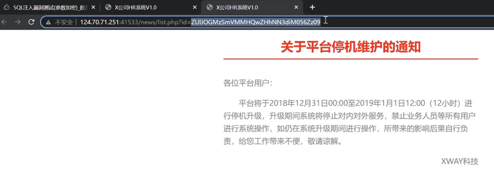

但是这个路径里面有压缩包(不然解不开了)
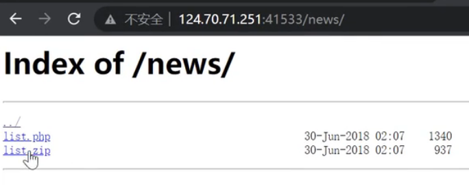

第7行发现了密钥和偏移量
第8行有两次base64编码
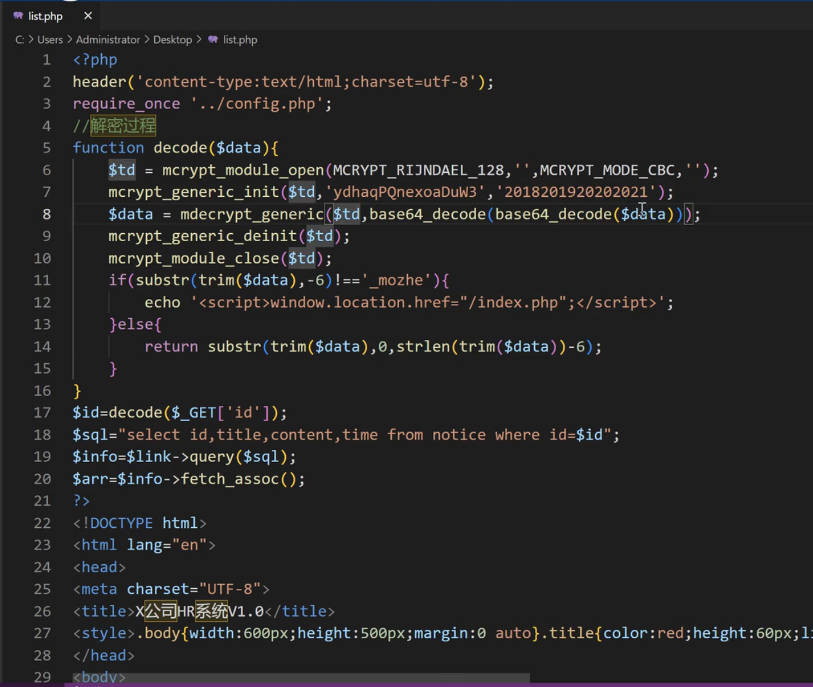

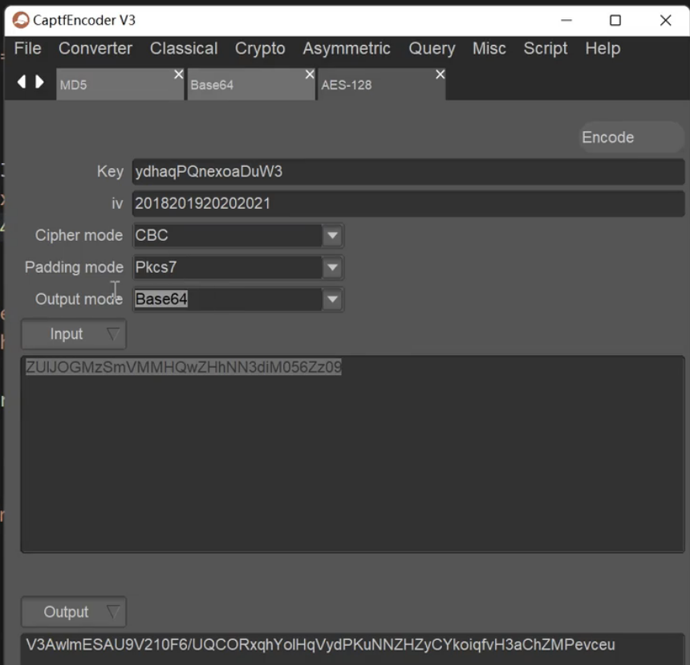

SQL注入语句`-1 union select 1,database(),user(),4_mozhe`需要按照源码的逻辑加密
再放进网址中执行
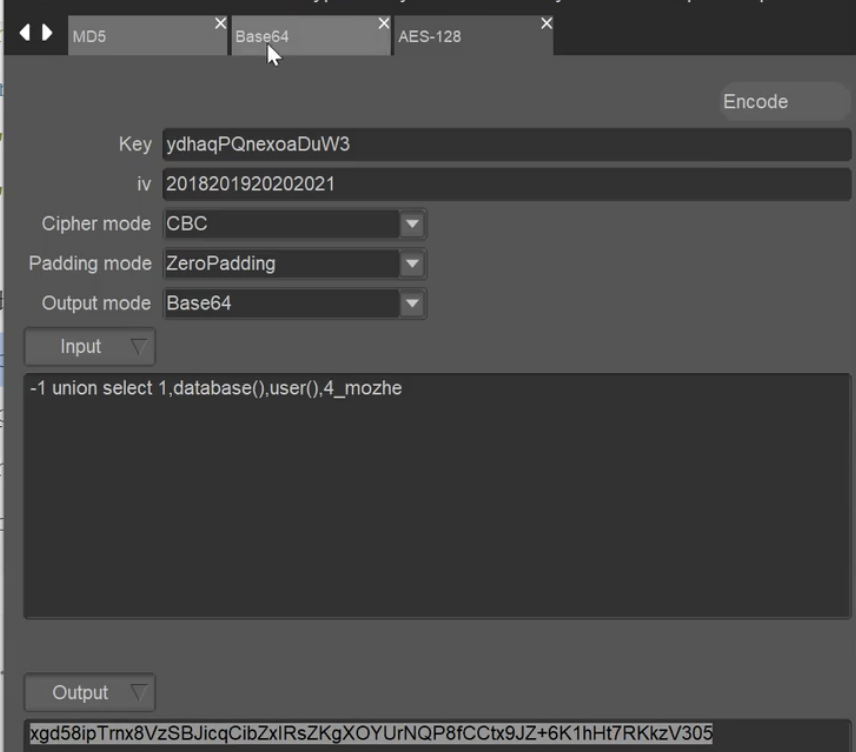

```
1. 获取源码 → 提取密钥和偏移量
2. 编写注入语句：' UNION SELECT ...
3. 按目标逻辑加密：
   明文 → AES加密 → Base64编码 → Base64再编码
4. 替换URL参数值发送
5. 目标服务器解密后正常执行SQL
```

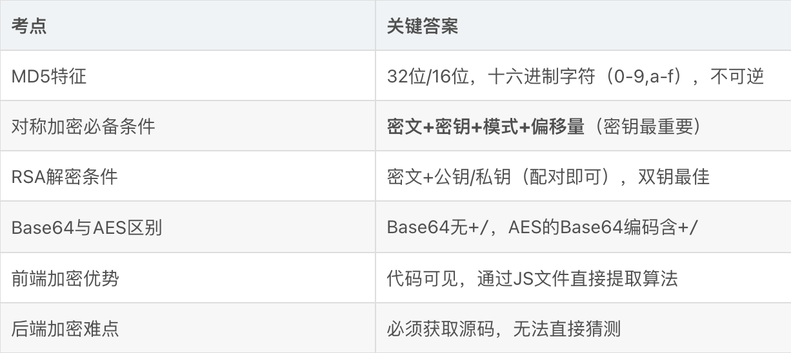

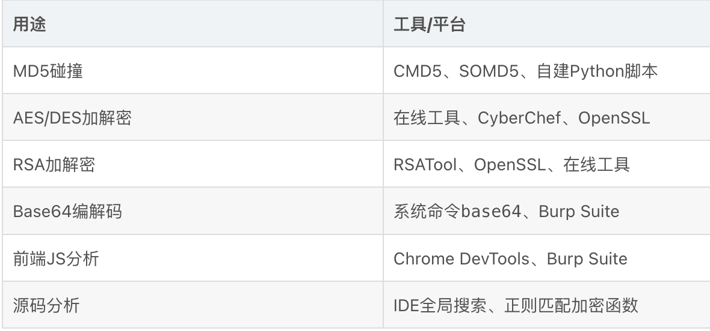

```
别人那里复制来的内容

CTF常见题型

    密文识别题：给定字符串判断加密类型

    密钥提取题：从JS/源码中找到隐藏密钥

    算法逆向题：根据加密逻辑编写解密脚本

    加密注入题：构造加密Payload完成SQL注入

面试高频问题

Q1：拿到一个32位十六进制字符串，如何解密？

    判断为MD5，使用在线平台碰撞；若失败，寻找源码确认是否加盐，构建自定义碰撞脚本。

Q2：AES加密数据如何解密？

    必须获取密钥、加密模式、偏移量。优先查看前端JS或后端源码，提取硬编码密钥。

Q3：RSA公钥加密的数据，只有公钥能解吗？

    不能。公钥加密需私钥解密，私钥加密需公钥解密。实战中应同时获取公私钥配对验证。

Q4：如何快速判断加密位置在前端还是后端？

    抓包对比输入密码与传输值：若传输值已加密→前端加密；若明文传输→后端加密。结合浏览器开发者工具查看JS文件确认。
```