**时间**　2026 年 5 月 6 日

**地点**　美国怀俄明州，黄石国家公园（Yellowstone National Park）

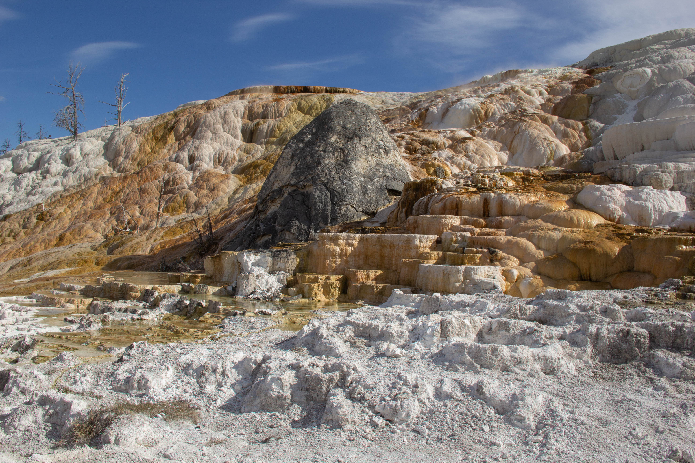

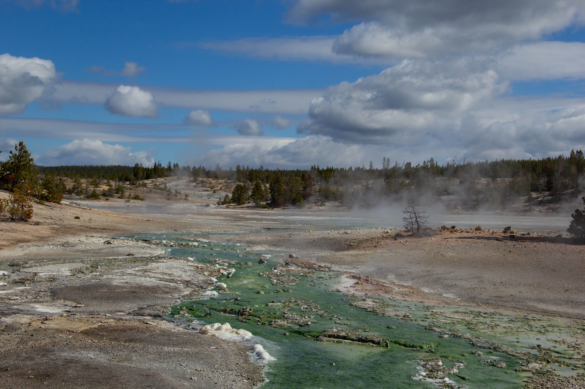

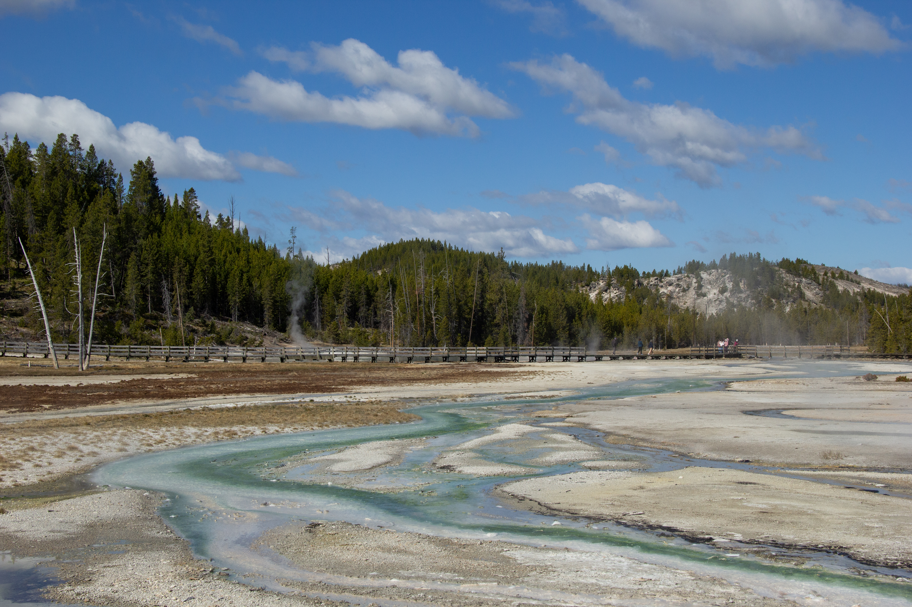

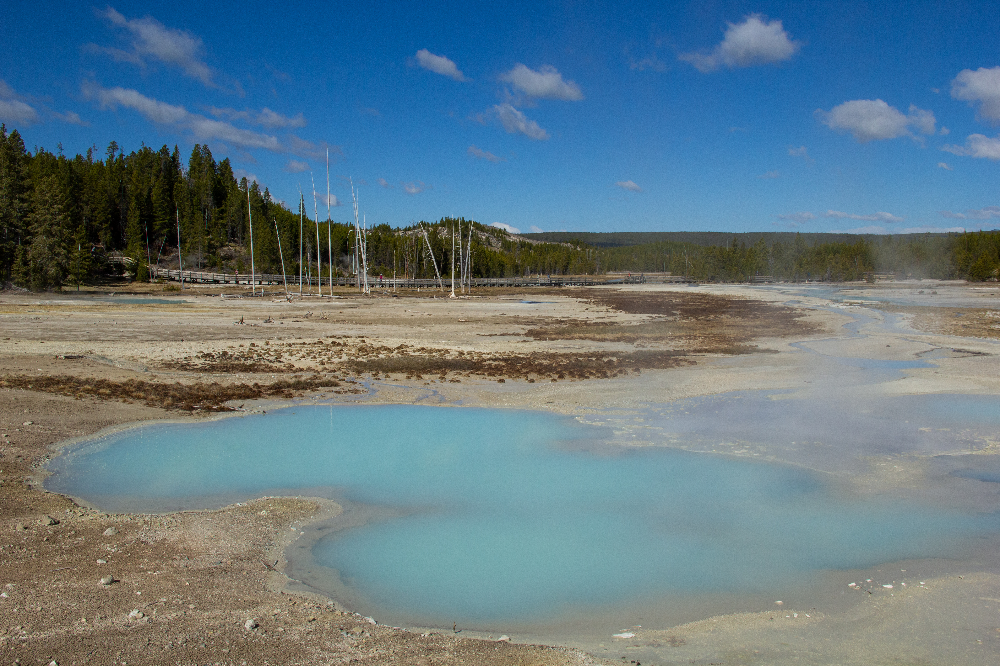

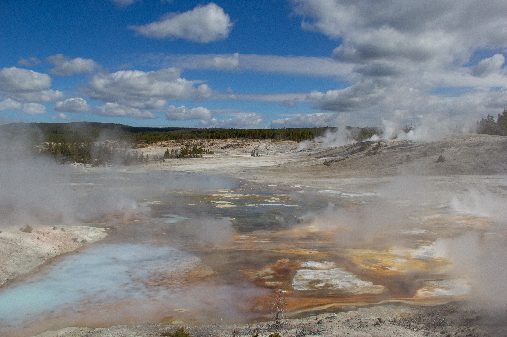

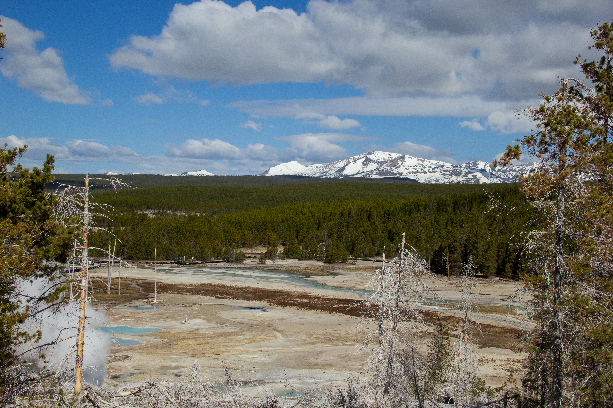

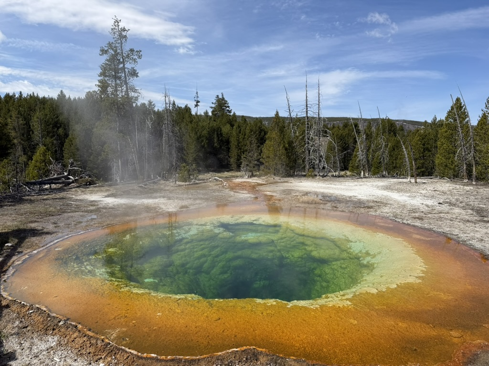

**晨曦池**　Morning Glory Pool，上间歇泉盆地　`44.47510, -110.84343`

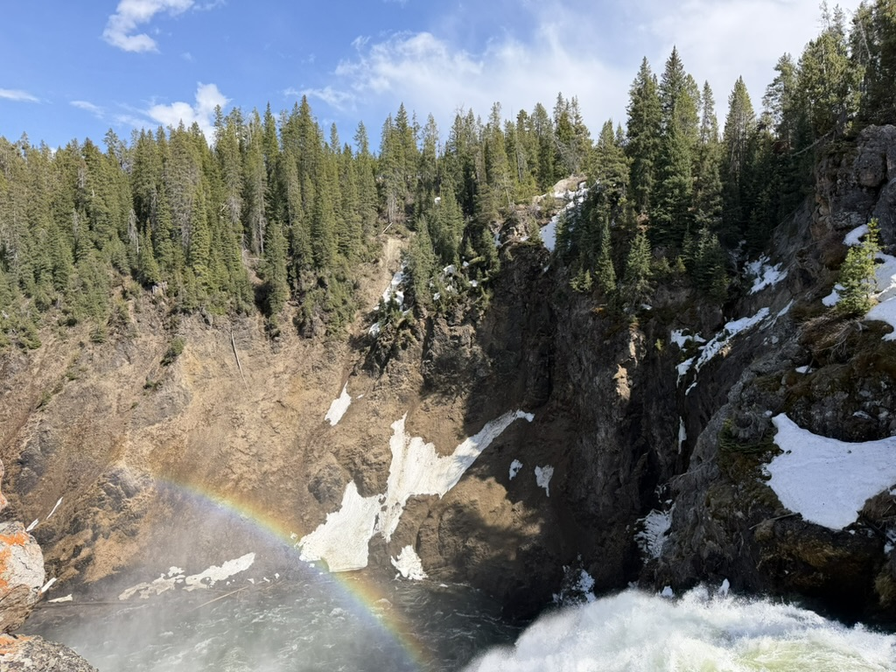

**上瀑布**　Upper Falls of the Yellowstone River，黄石大峡谷南缘　`44.71305, -110.49978`

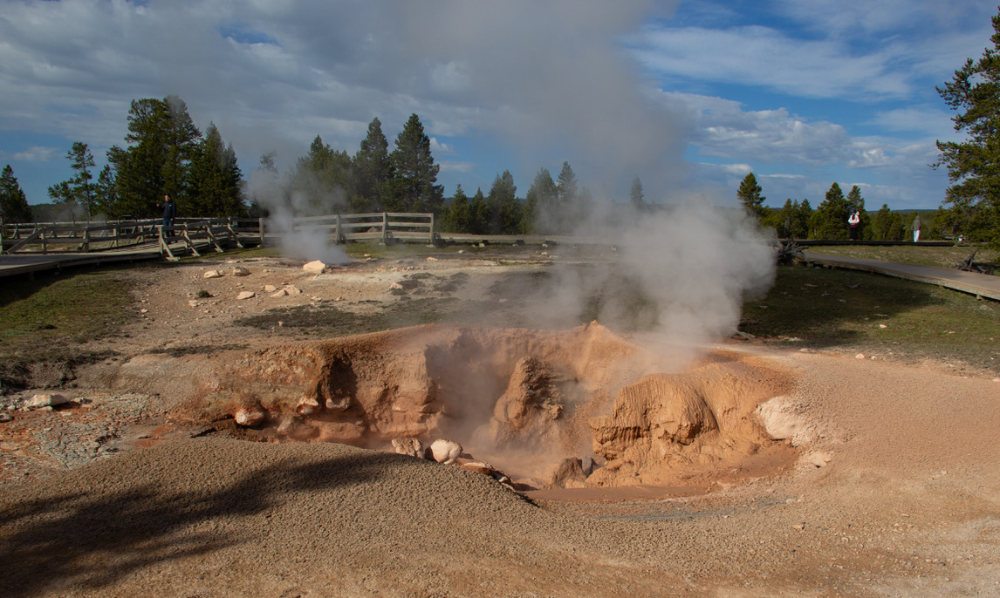

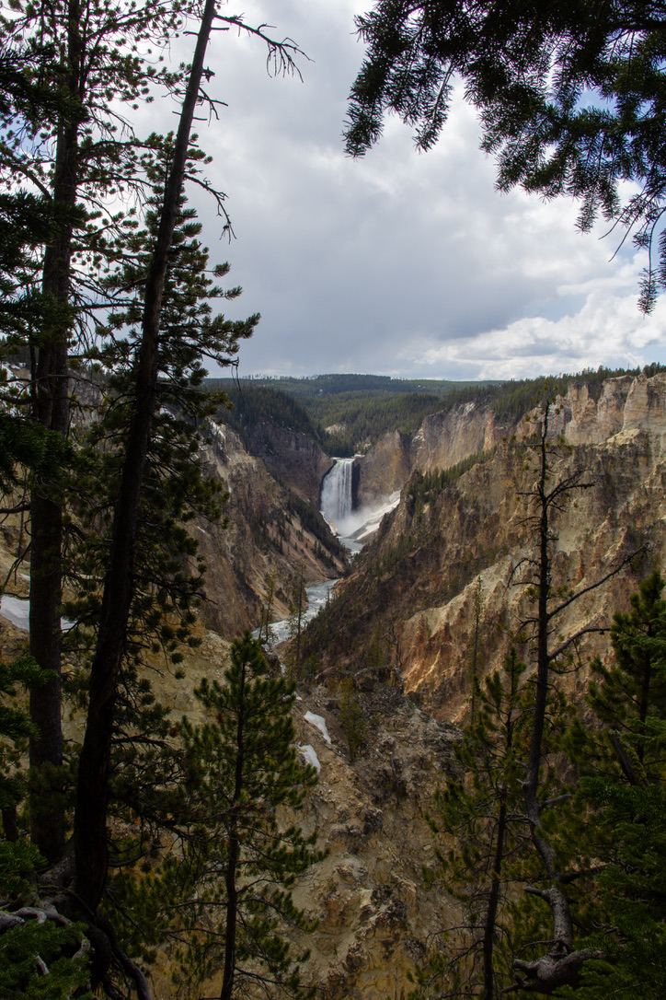

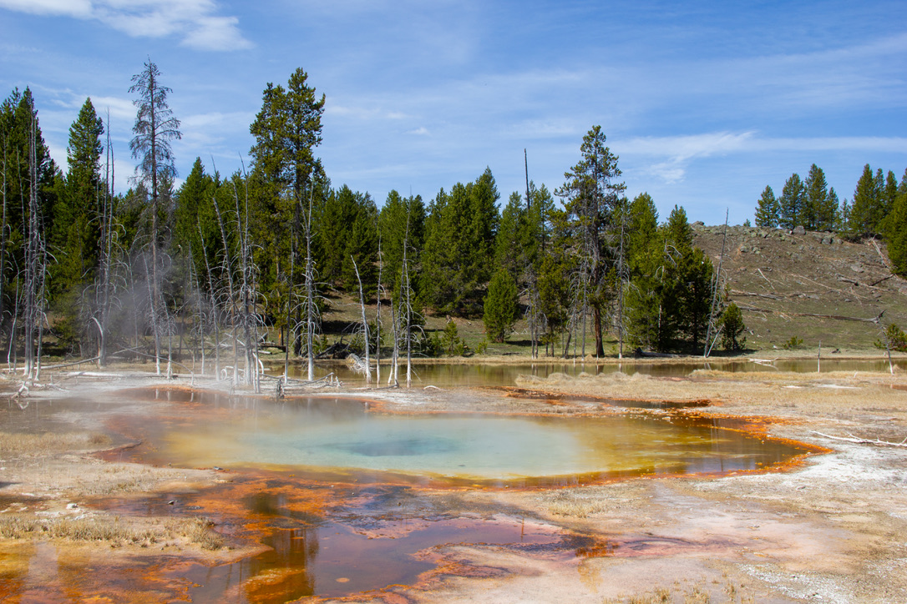

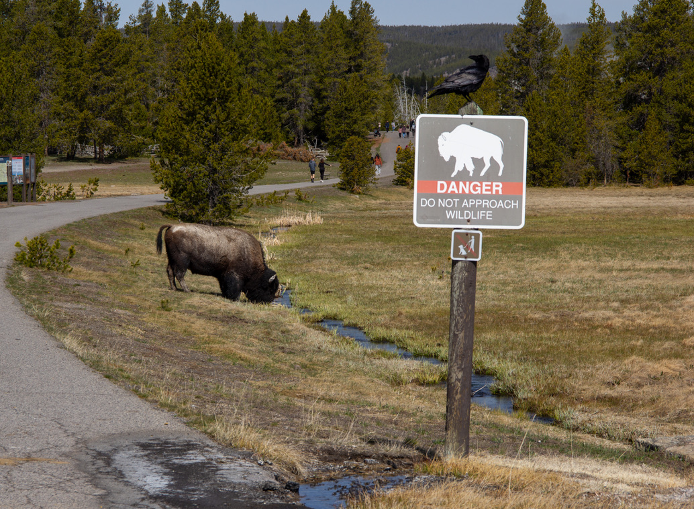

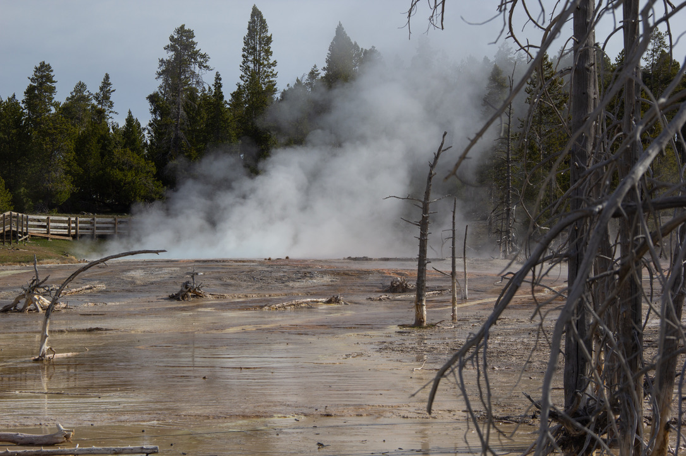

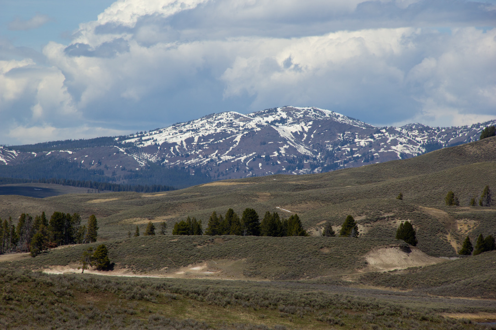

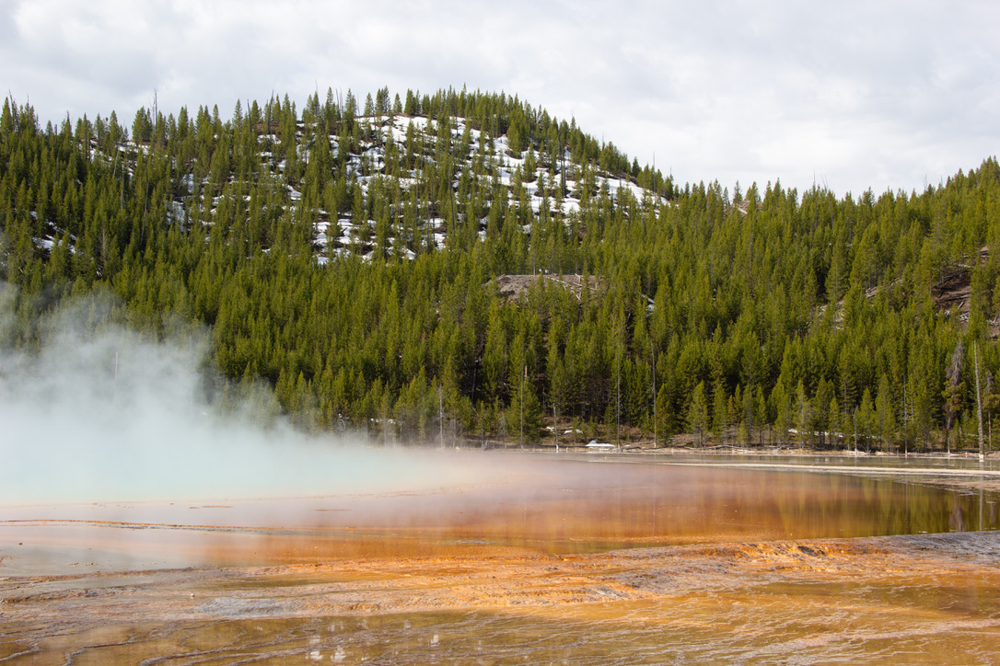
